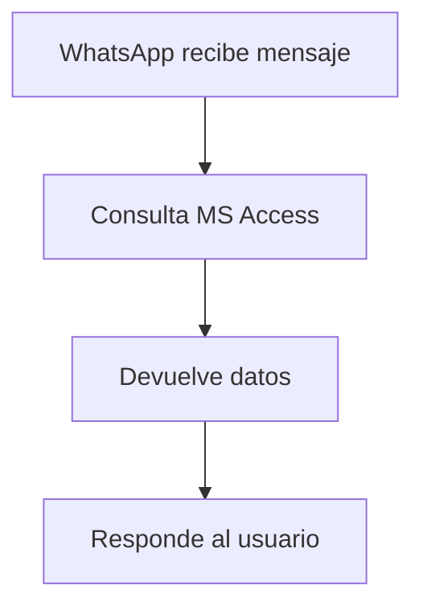

# mi-bot-whatsapp

## Recomendación Inicial

1. Si es para aprender o un proyecto personal pequeño: Prueba la librería whatsapp-web.js. Es compatible con Node.js/Express y es la forma más rápida de "atrapar" mensajes mediante eventos.

2. Si es para algo profesional o empresarial: Usa la API oficial de WhatsApp Business. Es la única forma legal, segura y estable de recibir mensajes en tu propia aplicación de Next.js o React mediante Webhooks.

### Paso 1: Requisitos previos

Necesitas tener instalado Node.js en tu computadora. Crea una carpeta para tu proyecto y ejecuta lo siguiente en tu terminal para iniciar el proyecto e instalar las librerías necesarias:

```bash
mkdir mi-bot-whatsapp
cd mi-bot-whatsapp
npm init -y
pnpm add whatsapp-web.js qrcode-terminal express -E
```

* ``whatsapp-web.js``: El motor que interactúa con WhatsApp.

* ``qrcode-terminal``: Para mostrar el código QR en la terminal y loguearte.

* ``express``: Para que tu servidor pueda exponer una API o mantenerse activo.

### Paso 2: El código del servidor (**`index.js`**)

Crea un archivo llamado index.js y pega el siguiente código:

```js
const { Client, LocalAuth } = require('whatsapp-web.js');
const qrcode = require('qrcode-terminal');
const express = require('express');

const app = express();
const port = 3000;

// 1. Configuración del cliente de WhatsApp
const client = new Client({
    authStrategy: new LocalAuth(), // Guarda la sesión para no escanear QR siempre
    puppeteer: {
        headless: true, // Cambia a false si quieres ver el navegador abrirse
        args: ['--no-sandbox']
    }
});

// 2. Generación del código QR para el login
client.on('qr', (qr) => {
    console.log('ESCANEA ESTE QR CON TU WHATSAPP:');
    qrcode.generate(qr, { small: true });
});

// 3. Confirmación de conexión
client.on('ready', () => {
    console.log('¡Conexión exitosa! El cliente está listo.');
});

// 4. "ATRAPAR" LOS MENSAJES (El evento principal)
client.on('message', async (msg) => {
    console.log(`Mensaje recibido de ${msg.from}: ${msg.body}`);

    // Ejemplo: Responder automáticamente si dicen "Hola"
    if (msg.body.toLowerCase() === 'hola') {
        msg.reply('¡Hola! Soy un bot conectado desde Express. 🤖');
    }
    
    // Aquí podrías enviar el mensaje a una base de datos o a tu app de React vía WebSockets
});

// 5. Iniciar cliente y servidor Express
client.initialize();

app.get('/', (req, res) => {
    res.send('Servidor de WhatsApp funcionando 🚀');
});

app.listen(port, () => {
    console.log(`Servidor Express corriendo en http://localhost:${port}`);
});
```

### Paso 3: Cómo ponerlo en marcha

1. En la terminal, ejecuta: <br/> `node index.js`

---
>[!CAUTION]
>
> Ejecuto el comando pero obtengo un error:
>```bash
>Servidor Express corriendo en http://localhost:3000
>.\node_modules\.pnpm\puppeteer-core@24.36.1\node_modules\puppeteer-core\lib\cjs\puppeteer\node\BrowserLauncher.js:333
>                    throw new Error(`Could not find Chrome (ver. ${this.puppeteer.browserVersion}). This can occur if either\n` +
>                          ^
>
>Error: Could not find Chrome (ver. 144.0.7559.96). This can occur if either
> 1. you did not perform an installation before running the script (e.g. `npx puppeteer browsers install chrome`) or
> 2. your cache path is incorrectly configured (which is: C:\Users\pizah\.cache\puppeteer).
>For (2), check out our guide on configuring puppeteer at https://pptr.dev/guides/configuration.
>```
>
> Ese es un error muy común. Lo que sucede es que la librería whatsapp-web.js depende de Puppeteer, el cual necesita descargar una versión específica de Chromium (el motor de Chrome) para funcionar. Por alguna razón, la instalación automática falló o no se ejecutó.
>
>Para solucionarlo, sigue estos pasos en tu terminal (dentro de la carpeta de tu proyecto):
>
>### 1. Forzar la instalación del navegador
>
>Ejecuta el comando que el mismo error te sugiere. Esto descargará el binario necesario en la carpeta de caché que mencionas:
>
>```bash
>npx puppeteer browsers install chrome
>```
>
>### 2. Si el error persiste (Solución manual)
>
>Si el paso anterior no funciona o prefieres usar el Chrome que ya tienes instalado en tu Windows para ahorrar espacio, puedes modificar tu código en index.js para decirle a la librería dónde está tu Chrome real.
>
>Modifica la sección del cliente así:
>```JavaScript
>const client = new Client({
>    authStrategy: new LocalAuth(),
>    puppeteer: {
>        headless: true,
>        // Reemplaza esta ruta por la de tu Chrome si es distinta
>        executablePath: 'C:\\Program Files\\Google\\Chrome\\Application\\chrome.exe', 
>        args: ['--no-sandbox', '--disable-setuid-sandbox']
>    }
>});
>```
>**Nota**: Asegúrate de usar doble barra diagonal \\ en la ruta si estás en Windows.
>
>### 3. Limpieza (Si nada de lo anterior funciona)
>
>A veces la carpeta node_modules se corrompe durante la instalación de Puppeteer. Si sigues con problemas, intenta esto:
>
>Borra la carpeta node_modules y el archivo package-lock.json.
>
>Ejecuta:<br/> `pnpm install`
>
>Vuelve a ejecutar:<br/> `node index.js`
---

2. Aparecerá un código **QR gigante** en la terminal.
3. Abre WhatsApp en tu celular -> **Dispositivos vinculados** -> **Vincular un dispositivo** <br/> y escanea el código de la terminal.
4. Una vez vinculado, verás en la consola el mensaje: ¡Conexión exitosa!.


### ¿Qué pasa después? (Cómo conectar con React/Next.js)

El código de arriba solo imprime los mensajes en la consola del servidor. Si quieres que esos mensajes aparezcan en tu aplicación de **React** o **Next.js** en tiempo real, tienes dos caminos:

* **WebSockets (Socket.io)**: Es la mejor forma. Cuando el `client.on('message')` detecta un mensaje, el servidor lo "emite" por un socket y tu app de React lo "escucha" y lo muestra en pantalla inmediatamente.

* **Base de Datos**: Guardas el mensaje en MongoDB o PostgreSQL y haces que tu app de React consulte esos datos.


### Notas de seguridad y estabilidad

* **LocalAuth**: Gracias a `new LocalAuth()`, se creará una carpeta llamada `.wwebjs_auth`. No la borres, ya que contiene tu sesión para que no tengas que escanear el QR cada vez que reinicies el servidor.

* **Baneos**: No uses este script para enviar spam (mensajes masivos a personas que no te tienen en sus contactos). WhatsApp es muy estricto y podría bloquear tu número.

¿Te gustaría que te mostrara cómo añadir **Socket.io** al ejemplo anterior para enviar el mensaje directamente a tu frontend?

---

## Socket.io

¡Excelente! Al integrar **Socket.io**, crearemos un puente en tiempo real. Cuando `whatsapp-web.js` detecte un mensaje en tu servidor de Node.js, lo "gritará" inmediatamente hacia tu aplicación de React/Next.js sin que tengas que refrescar la página.

Aquí tienes la configuración necesaria:

### 1. Instalación de Socket.io

Primero, instala la librería en tu servidor:
```Bash
pnpm add socket.io -E
```

>[!WARNING]
>
> Instala pero con algunas advertencias:
>```dos
>WARN  5 deprecated subdependencies found: fluent-ffmpeg@2.1.3, fstream@1.0.12, glob@7.2.3, inflight@1.0.6, rimraf@2.7.1
>```
>```dos
>╭ Warning ───────────────────────────────────────────────────────────────────────────────────╮
>│                                                                                            │
>│   Ignored build scripts: puppeteer.                                                        │
>│   Run "pnpm approve-builds" to pick which dependencies should be allowed to run scripts.   │
>│                                                                                            │
>╰────────────────────────────────────────────────────────────────────────────────────────────╯
>

### 2. Servidor Express actualizado (index.js)

Vamos a envolver el servidor de Express con Socket.io para permitir la comunicación bidireccional:

```JavaScript
const { Client, LocalAuth } = require('whatsapp-web.js');
const qrcode = require('qrcode-terminal');
const express = require('express');
const http = require('http'); // Necesario para Socket.io
const { Server } = require('socket.io');

const app = express();
const server = http.createServer(app);
const port = 3000;

const io = new Server(server, {
  cors: {
    origin: 'http://localhost:5173', // La URL de tu app de React/Next.js
    methods: ['GET', 'POST'],
  },
});

// 1. Configuración del cliente de WhatsApp
const client = new Client({
  authStrategy: new LocalAuth(), // Guarda la sesión para no escanear QR siempre
  puppeteer: {
    headless: true, // Cambia a false si quieres ver el navegador abrirse
    //args: ['--no-sandbox'], // tengo un error asi que lo camcio
    // Reemplaza esta ruta por la de tu Chrome si es distinta
    executablePath:
      'C:\\Program Files (x86)\\Google\\Chrome\\Application\\chrome.exe',
    args: ['--no-sandbox', '--disable-setuid-sandbox'],
  },
});

// 2. Evento de conexión de Socket.io
io.on('connection', (socket) => {
  console.log('Un cliente (React) se ha conectado');
});

// 3. Generación del código QR para el login
client.on('qr', (qr) => {
  console.log('ESCANEA ESTE QR CON TU WHATSAPP:');
  qrcode.generate(qr, { small: true });
  // Opcional: Enviar el QR al frontend si quieres mostrarlo en la web
  io.emit('qr-code', qr);
});

// 4. Confirmación de conexión
client.on('ready', () => {
  console.log('¡Conexión exitosa! El cliente está listo.');
  io.emit('status', 'Conectado');
});

// 5. "ATRAPAR" LOS MENSAJES (El evento principal)
client.on('message', async (msg) => {
  console.log(`Mensaje recibido de ${msg.from}: ${msg.body}`);
  console.log(msg);

  // Ejemplo: Responder automáticamente si dicen "Hola"
  if (msg.body.toLowerCase() === 'hola') {
    msg.reply('¡Hola! Soy un bot conectado desde Express. 🤖');
  }

  // Aquí podrías enviar el mensaje a una base de datos o a tu app de React vía WebSockets
  // Enviamos el objeto del mensaje completo a React
  io.emit('new-message', {
    from: msg.from,
    body: msg.body,
    timestamp: new Date().toLocaleTimeString(),
  });
});

// 6. Iniciar cliente y servidor Express
client.initialize();

app.get('/', (req, res) => {
  res.send('Servidor de WhatsApp funcionando 🚀');
});

app.listen(port, () => {
  console.log(`Servidor Express corriendo en http://localhost:${port}`);
});
```

### 3. Creación del Frontend con **Vite**.

1. Estando en la raíz de nuestro proyecto ejecutamos este comando
usando `VITE`:
```bash
pnpm create vite@latest . --template react-ts
```
2. Esto es el resultado del proceso:
```dos
◇  Current directory is not empty. Please choose how to proceed:
│  Ignore files and continue
│
◇  Use rolldown-vite (Experimental)?:
│  No
│
◇  Install with pnpm and start now?
│  Yes
│
◇  Scaffolding project in E:\tutorials\nodejs\mi-bot-whatsapp...
│
◇  Installing dependencies with pnpm...
```
3. Crea varios archivos y cambia a **`package.json`**, le completo lo antes borrando dejando este de esta manera:
```json
{
  "name": "mi-bot-whatsapp",
  "private": true,
  "version": "1.0.0",
  "description": "Necesitas tener instalado Node.js en tu computadora. Crea una carpeta para tu proyecto y ejecuta lo siguiente en tu terminal para iniciar el proyecto e instalar las librerías necesarias:",
  "main": "index.cjs",
  "type": "module",
  "scripts": {
    "start": "node --watch index.cjs",
    "dev": "vite",
    "build": "tsc -b && vite build",
    "lint": "eslint .",
    "preview": "vite preview"
  },
  "repository": {
    "type": "git",
    "url": "git+https://github.com/JDGonzal/mi-bot-whatsapp.git"
  },
  "keywords": [],
  "author": "",
  "license": "ISC",
  "bugs": {
    "url": "https://github.com/JDGonzal/mi-bot-whatsapp/issues"
  },
  "homepage": "https://github.com/JDGonzal/mi-bot-whatsapp#readme",
  "dependencies": {
    "express": "5.2.1",
    "qrcode-terminal": "0.12.0",
    "react": "^19.2.0",
    "react-dom": "^19.2.0",
    "socket.io": "4.8.3",
    "whatsapp-web.js": "1.34.6"
  },
  "devDependencies": {
    "@eslint/js": "^9.39.1",
    "@types/node": "^24.10.1",
    "@types/react": "^19.2.5",
    "@types/react-dom": "^19.2.3",
    "@vitejs/plugin-react": "^5.1.1",
    "eslint": "^9.39.1",
    "eslint-plugin-react-hooks": "^7.0.1",
    "eslint-plugin-react-refresh": "^0.4.24",
    "globals": "^16.5.0",
    "typescript": "~5.9.3",
    "typescript-eslint": "^8.46.4",
    "vite": "^7.2.4"
  }
}
```
4. Borro la carpeta **"node_modules"**, y ejecuto en la `TERMINAL` este comando: <br/>`pnpm i`.
5. Renombro el archivo **`index.js`** por **`index.cjs`**.
6. En una `TERMINAL` ejecuto este comando: <br/>`pnpm start` <br/> Esto pone a correr el _backend_, en este caso el **express** en la ruta: <br/> `http://localhost:3000`
7. En otra `TERMINAL` pongo este comando: <br/> `pnpm dev` <br/> Así se ejecuta el _frontend_ , con **vite** y **react**, en esta _url_: <br/> `http://localhost:5173/`.
8. Corrijo el **`.gitignore`**:
```yml
# Logs
logs
*.log
npm-debug.log*
yarn-debug.log*
yarn-error.log*
pnpm-debug.log*`
# Diagnostic reports (https://nodejs.org/api/report.html)
report.[0-9]*.[0-9]*.[0-9]*.[0-9]*.json

# Runtime data
pids
*.pid
*.seed
*.pid.lock

# Directory for instrumented libs generated by jscoverage/JSCover
lib-cov

# Coverage directory used by tools like istanbul
coverage
*.lcov

# nyc test coverage
.nyc_output

# Grunt intermediate storage (https://gruntjs.com/creating-plugins#storing-task-files)
.grunt

# Bower dependency directory (https://bower.io/)
bower_components

# node-waf configuration
.lock-wscript

# Compiled binary addons (https://nodejs.org/api/addons.html)
build/Release

# Dependency directories
node_modules/
jspm_packages/

# Snowpack dependency directory (https://snowpack.dev/)
web_modules/

# TypeScript cache
*.tsbuildinfo

# Optional npm cache directory
.npm

# Optional eslint cache
.eslintcache

# Optional stylelint cache
.stylelintcache

# Optional REPL history
.node_repl_history

# Output of 'npm pack'
*.tgz

# Yarn Integrity file
.yarn-integrity

# dotenv environment variable files
.env
.env.*
!.env.example

# parcel-bundler cache (https://parceljs.org/)
.cache
.parcel-cache

# Next.js build output
.next
out

# Nuxt.js build / generate output
.nuxt
dist

# Gatsby files
.cache/
# Comment in the public line in if your project uses Gatsby and not Next.js
# https://nextjs.org/blog/next-9-1#public-directory-support
# public

# vuepress build output
.vuepress/dist

# vuepress v2.x temp and cache directory
.temp
.cache

# Sveltekit cache directory
.svelte-kit/

# vitepress build output
**/.vitepress/dist

# vitepress cache directory
**/.vitepress/cache

# Docusaurus cache and generated files
.docusaurus

# Serverless directories
.serverless/

# FuseBox cache
.fusebox/

# DynamoDB Local files
.dynamodb/

# Firebase cache directory
.firebase/

# TernJS port file
.tern-port

# Stores VSCode versions used for testing VSCode extensions
.vscode-test

# yarn v3
.pnp.*
.yarn/*
!.yarn/patches
!.yarn/plugins
!.yarn/releases
!.yarn/sdks
!.yarn/versions

lerna-debug.log*

node_modules
dist
dist-ssr
*.local

# Editor directories and files
.vscode/*
!.vscode/extensions.json
.idea
.DS_Store
*.suo
*.ntvs*
*.njsproj
*.sln
*.sw?

#Authorization WhatsApp
.wwebjs_auth/
.wwebjs_cache
```

### 4. Código básico para tu Frontend con `socket.io-client` (React/Next.js)

1. Para recibir esos mensajes en tu interfaz, necesitarás instalar socket.io-client en tu proyecto de frontend:
```Bash
pnpm add socket.io-client -E
```
2. Creamos el componente **`src\components\WhatsAppViewer.tsx`**:

```JavaScript
import { useEffect, useState } from 'react';
import io from 'socket.io-client';

interface Message {
  from: string;
  body: string;
  timestamp: string;
}

export default function WhatsAppViewer() {
  const [messages, setMessages] = useState<Message[]>([]);

  useEffect(() => {
    // Create the socket inside the effect so listeners are attached after component mounts
    const socket = io('http://localhost:3000', { transports: ['websocket'] });

    socket.on('connect', () => {
      console.log('Socket connected:', socket.id);
    });

    socket.on('connect_error', (err) => {
      console.error('Socket connect error:', err);
    });

    // Log incoming events to help debugging and normalize payload to our Message shape
    // eslint-disable-next-line @typescript-eslint/no-explicit-any
    socket.on('new-message', (data: any) => {
      console.log('Received new-message:', data);

      const message: Message = {
        from: (data?.from) ?? (data?.notifyName) ?? (data?._data?.notifyName) ?? 'unknown',
        body: data?.body ?? '',
        timestamp:
          typeof data?.timestamp === 'number'
            ? new Date(data.timestamp * 1000).toLocaleString()
            : data?.timestamp ?? (data?.t ? new Date(data.t * 1000).toLocaleString() : new Date().toLocaleString()),
      };

      setMessages((prev) => [...prev, message]);
    });

    return () => {
      // Remove listeners and disconnect to avoid leaking sockets / duplicate listeners
      socket.off('new-message');
      socket.off('connect');
      socket.off('connect_error');
      socket.disconnect();
    };
  }, []);

  return (
    <div>
      <h1>Mensajes de WhatsApp en vivo</h1>
      <ul>
        {messages.map((m, i) => (
          <li key={i}>
            <strong>{m.from}:</strong> {m.body} <small>{m.timestamp}</small>
          </li>
        ))}
      </ul>
    </div>
  );
}
```

### ¿Qué logramos con esto?

1.Tu servidor Node.js actúa como el "cerebro" que lee WhatsApp.
2. **Socket.io** actúa como el "cable" que conecta el cerebro con tu interfaz visual.
3. Cada vez que llega un mensaje (como los que se ven en tu [WhatsApp](https://web.whatsapp.com/)), este aparecerá automáticamente en tu lista de React.

---

## Leer los mensajer recibidos y generados

Sí, es totalmente posible. Con la librería **`whatsapp-web.js`**, puedes capturar no solo los mensajes que recibes de otros, sino también los mensajes que tú mismo envías desde cualquier otro dispositivo vinculado (como tu celular o la aplicación de escritorio).

Para lograr esto, solo necesitas añadir un evento adicional a tu archivo **`index.cjs`**. Actualmente estás usando client.on('message', ...), que solo se activa con mensajes entrantes. El evento que necesitas para los mensajes que tú envías es `message_create`.

### 1. Actualización en tu **`index.cjs`** (Servidor)

Añade este bloque de código debajo de tu actual `client.on('message', ...)`:

```JavaScript
// Este evento detecta TODOS los mensajes: los que recibes y los que ENVÍAS
client.on('message_create', async (msg) => {
    // msg.fromMe es true si el mensaje lo enviaste tú desde cualquier dispositivo
    if (msg.fromMe) {
        console.log(`Mensaje enviado por mí desde otro dispositivo: ${msg.body}`);

        // Enviamos el mensaje al frontend vía Socket.io
        io.emit('new-message', {
            from: 'Yo', // O puedes usar msg.to para saber a quién se lo enviaste
            body: msg.body,
            timestamp: new Date().toLocaleTimeString(),
            isMine: true // Útil para darle un estilo diferente en React
        });
    }
});
```

### 2. ¿Por qué funciona así?

* **`message` vs `message_create`**: El evento `message` se dispara únicamente cuando entra algo nuevo a tu bandeja de entrada de otra persona. El evento `message_create` se dispara cada vez que se crea un mensaje en el ecosistema de tu cuenta, sin importar el origen.

* **Sincronización**: Como WhatsApp Web mantiene sincronizados todos los chats, cuando escribes algo en tu teléfono, el "navegador invisible" que corre en tu servidor de Express detecta esa actualización casi instantáneamente y dispara el evento.

### 3. Ajuste sugerido en el Frontend (React)

Si decides enviar la propiedad `isMine: true` como puse en el ejemplo, podrías mejorar tu componente para que los mensajes se vean distintos (como en WhatsApp real):

```JavaScript
// En tu mapeo de mensajes en React
{messages.map((m, i) => (
  <li key={i} style={{ textAlign: m.isMine ? 'right' : 'left', color: m.isMine ? 'blue' : 'black' }}>
    <strong>{m.from}:</strong> {m.body}
  </li>
))}
```
Con este cambio, tu aplicación de Node/React será un reflejo fiel de todo lo que pase en tu cuenta, permitiéndote "atrapar" tanto lo que te dicen como lo que tú respondes desde el móvil.

---

## OCR (Reconocimiento Óptico de Caracteres)


Para procesar imágenes y aplicar OCR (Reconocimiento Óptico de Caracteres) dentro de tu servidor de Node.js, la herramienta estándar y más sencilla es **`Tesseract.js`**.

Como estás usando `whatsapp-web.js`, el flujo consiste en detectar si el mensaje tiene una imagen, descargarla y luego pasarla por el motor de OCR.

### 1. ✅ Instalación de la librería

Primero, añade **Tesseract** a tu proyecto:

```Bash
pnpm add tesseract.js -E
```

### 2. ✅ Detectar mensajes con imagen en WhatsApp

En `whatsapp-web.js` debes escuchar los mensajes y verificar si tienen media:
```js
client.on('message', async (msg) => {
  if (msg.hasMedia) {
    const media = await msg.downloadMedia()
    console.log('Imagen recibida')
  }
})
```

### 3. ✅ Convertir la imagen a buffer

**Tesseract** trabaja mejor con buffer o archivo.
```js
const buffer = Buffer.from(media.data, 'base64')
```
Ahora ya tienes la imagen lista para OCR.

### 4. ✅ Ejecutar _OCR_ con **Tesseract**

Importa tesseract:
```js
const Tesseract = require('tesseract.js')
```

Luego:
```js
const result = await Tesseract.recognize(buffer, 'eng', {
  logger: m => console.log(m) // progreso opcional
})

const texto = result.data.text
console.log('Texto detectado:', texto)
```

### 5. ✅ Extraer SOLO números

Si quieres números más que texto:
```js
const numeros = texto.match(/\d+/g)
console.log('Números detectados:', numeros)
```
Eso devuelve:
```css
["123", "456", "789"]
```
Si no encuentra nada → `null`.

### 6. 🔥 Ejemplo completo integrado

Pon esto dentro de tu index.cjs:
```js
const Tesseract = require('tesseract.js')

client.on('message', async (msg) => {
  if (!msg.hasMedia) return

  try {
    const media = await msg.downloadMedia()
    const buffer = Buffer.from(media.data, 'base64')

    const result = await Tesseract.recognize(buffer, 'eng',{
      logger: m => console.log(m) // progreso opcional
    })
    const texto = result.data.text

    const numeros = texto.match(/\d+/g)

    if (numeros) {
      await msg.reply(`Números detectados: ${numeros.join(', ')}`)
    } else {
      await msg.reply('No detecté números en la imagen')
    }

  } catch (err) {
    console.error(err)
    msg.reply('Error leyendo la imagen')
  }
})
```

### 7.⚡ Mejora importante (recomendado)

Para OCR de números, usa whitelist:
```js
const result = await Tesseract.recognize(buffer, 'eng', {
  tessedit_char_whitelist: '0123456789'
})
```

Esto le dice a **Tesseract**:

👉 “Ignora letras, solo números”

Aumenta muchísimo la precisión.

### 8. Enviamos el objeto del mensaje completo a React

```js
      io.emit('new-message', {
        to: msg.to,
        from: msg.from,
        body: numeros.join(', '),
        timestamp: new Date().toLocaleTimeString(),
      });
```

## Flujo conversacional + Estado por usuario.

WhatsApp no tiene “popups”, así que se simula una pantalla preguntando y esperando respuesta.


### 🧠 Concepto clave: estado por usuario

Necesitas un “almacén” de memoria temporal:
```js
const estados = new Map()
```

Cada usuario tendrá algo como:
```js
{
  esperandoConfirmacion: true,
  numeros: [...],
  buffer: imagenOriginal
}
```

### ✅ Paso 1 — Cuando detectas números → preguntar

Modifica tu código OCR:
```js
const numeros = texto.match(/\d+/g)

if (numeros) {
  estados.set(msg.from, {
    esperandoConfirmacion: true,
    numeros,
    buffer
  })

  await msg.reply(
    `Números detectados: ${numeros.join(', ')}\n\n¿Están correctos? S/N`
  )
}
```

### ✅ Paso 2 — Capturar respuesta del usuario

ANTES del OCR, agrega este bloque al listener:
```js
client.on('message', async (msg) => {

  const estado = estados.get(msg.from)

  // Si está esperando confirmación
  if (estado?.esperandoConfirmacion) {

    const respuesta = msg.body.trim().toLowerCase()

    if (respuesta === 's') {
      estados.delete(msg.from)
      return msg.reply('✅ Confirmado. Guardado.')
    }

    if (respuesta === 'n') {
      await msg.reply('🔄 Reintentando lectura girando imagen...')
      return reprocesarImagen(msg, estado)
    }

    return msg.reply('Responde S o N')
  }

  // ---- Aquí sigue tu lógica normal de OCR ----
})
```

### ✅ Paso 3 — Reprocesar girando la imagen

Necesitas una librería para rotar imágenes:

👉 instala:
```bash
pnpm add sharp -E
```
>[!WARNING]
>
>**Aparece este mensaje después de la instalación:**
>```dos
>╭ Warning ───────────────────────────────────────────────────────────────────────────────────╮
>│                                                                                            │
>│   Ignored build scripts: sharp.                                                            │
>│   Run "pnpm approve-builds" to pick which dependencies should be allowed to run scripts.   │
>│                                                                                            │
>╰────────────────────────────────────────────────────────────────────────────────────────────╯
>```
>1. Entonces probamos el comando:
>```bash
>pnpm approve-builds
>```
>2. Me aparecen estas estas opciones:
>```dos
>? Choose which packages to build (Press <space> to select, <a> to toggle all, <i> to invert selection) ... 
>❯ ○ sharp
>```
>3. Le damos a la [`Space-Bar`] y la tecla [`ENTER`] <br/>
>Nos pregunta:
>```dos
>Do you approve? (y/N) » false
>```
>4. Le damos la tecla [`y`] <br/>
>y al final aparece:
>```dos
>node_modules/.pnpm/sharp@0.34.5/node_modules/sharp: Running install script, done in 785ms
>```


Luego:
```js
const sharp = require('sharp')
const Tesseract = require('tesseract.js')
```

Función:
```js
async function reprocesarImagen(msg, estado) {
  try {
    const rotada = await sharp(estado.buffer)
      .rotate(90)
      .toBuffer()

    const result = await Tesseract.recognize(rotada, 'eng', {
      tessedit_char_whitelist: '0123456789'
    })

    const texto = result.data.text
    const numeros = texto.match(/\d+/g)

    estados.set(msg.from, {
      esperandoConfirmacion: true,
      numeros,
      buffer: rotada
    })

    await msg.reply(
      `Nueva lectura: ${numeros?.join(', ') || 'Nada detectado'}\n\n¿Correcto? S/N`
    )

  } catch (err) {
    console.error(err)
    msg.reply('Error reprocesando imagen')
  }
}
```

### 🚀 Extra pro (opcional)

Puedes intentar múltiples rotaciones:
```js
.rotate(180)
.rotate(270)
```

Hasta encontrar la mejor lectura.

O guardar historial:
```makefile
intentos: 1, 2, 3...
```

### Cambios como validar imagenes y si validar textos

1. No me interesa hacer revalidación de las imágenes, por ende no requerimos el `sharp`, entonces desinstalo la librería : <br/> `pnpm remove sharp`
2. Quitamos del código la importación de `sharp`, la función que la usa:
```js
// const sharp = require('sharp');
...
// ===== Reprocesar imagen rotada =====
// async function reprocesarImagen(msg, estado) {
//   try {
//     const rotada = await sharp(estado.buffer).rotate(90).toBuffer();

//     const numeros = await leerNumeros(rotada);

//     estados.set(msg.from, {
//       esperandoConfirmacion: true,
//       numeros,
//       buffer: rotada,
//     });

//     await msg.reply(
//       `Nueva lectura: ${numeros?.join(', ') || 'Nada detectado'}\n\n¿Correcto? S/N`,
//     );
//   } catch (err) {
//     console.error(err);
//     msg.reply('Error reprocesando imagen');
//   }
// }
...
    if (respuesta === 'n' || respuesta === 'no') {
      // await msg.reply('🔄 Girando imagen y reintentando...');
      // return reprocesarImagen(msg, estado);
      return msg.reply(`Sugerencia: 
        1. Mejora la imagen y envia de nuevo. 
        2. O digita la lista de números separados por comas.`);
    }
```
3. Añadimos la validación de números que se digitan:
```js
  const texto = msg.body;
  const numeros = texto.match(/\d+/g);
  const estado = estados.get(msg.from);

  if (numeros) {
    estados.set(msg.from, {
      esperandoConfirmacion: true,
      numeros,
      texto,
    });
    console.log(`Números detectados: ${numeros.join(', ')}`);
    return msg.reply(
      `Números detectados: ${numeros.join(', ')}\n\n¿Están correctos? S/N`,
    );
  }
```
4. Se borra el archivo no necesario de **`pnpm-workspace.yaml`**.
5. Se renombra el actual **`index.cjs`** a **`index-express-socket-io.cjs`**.
6. Se crea el archivo simple de **`index.cjs`**:
```js
const { Client, LocalAuth } = require('whatsapp-web.js');
const qrcode = require('qrcode-terminal');
const Tesseract = require('tesseract.js');

// ===== Estado por usuario =====
const estados = new Map();

// ===== Cliente WhatsApp =====
const client = new Client({
  authStrategy: new LocalAuth(), // Guarda la sesión para no escanear QR siempre
  puppeteer: {
    headless: true, // Cambia a false si quieres ver el navegador abrirse
    //args: ['--no-sandbox'], // tengo un error asi que lo camcio
    // Reemplaza esta ruta por la de tu Chrome si es distinta
    executablePath:
      'C:\\Program Files (x86)\\Google\\Chrome\\Application\\chrome.exe',
    args: ['--no-sandbox', '--disable-setuid-sandbox'],
  },
});

client.on('qr', (qr) => {
  qrcode.generate(qr, { small: true });
  console.log('Escanea el QR');
});

client.on('ready', () => {
  console.log('Bot listo ✅');
});

// ===== Función OCR =====
async function leerNumeros(buffer) {
  const result = await Tesseract.recognize(buffer, 'eng', {
    tessedit_char_whitelist: '0123456789',
  });

  const texto = result.data.text;
  return texto.match(/\d+/g);
}


// ===== Listener principal =====
client.on('message', async (msg) => {
  console.log(`Mensaje recibido de ${msg.from}: ${msg.body}`);
  // Ejemplo: Responder automáticamente si dicen "Hola"
  if (msg.body.toLowerCase() === 'hola') {
    return msg.reply(
      '¡Hola! \n Por favor digita los números de las boletas separados por comas o envía una imagen con los números visibles en forma horizontal.',
    );
  }

  const texto = msg.body;
  const numeros = texto.match(/\d+/g);
  const estado = estados.get(msg.from);

  if (numeros) {
    estados.set(msg.from, {
      esperandoConfirmacion: true,
      numeros,
      texto,
    });
    console.log(`Números detectados: ${numeros.join(', ')}`);
    return msg.reply(
      `Números detectados: ${numeros.join(', ')}\n\n¿Están correctos? S/N`,
    );
  }
  // ===== Caso: esperando confirmación =====
  if (await estado?.esperandoConfirmacion) {
    const respuesta = msg.body.trim().toLowerCase();

    if (
      respuesta === 's' ||
      respuesta === 'si' ||
      respuesta === 'y' ||
      respuesta === 'yes'
    ) {
      console.log(`✅ Confirmado. Guardado de ${msg.from}`);
      console.log(estado.numeros.join(', '))
      estados.delete(msg.from);
      
      return msg.reply('✅ Confirmado. Guardado.');
    }

    if (respuesta === 'n' || respuesta === 'no') {
      return msg.reply('*Sugerencia*:\n1️⃣ Mejora la imagen y envía de nuevo.\n2️⃣ O digita la lista de números separados por comas.');
    }

    return msg.reply('Responde S o N');
  }

  // ===== Caso: mensaje con imagen =====
  if (msg.hasMedia) {
    try {
      const media = await msg.downloadMedia();
      const buffer = Buffer.from(media.data, 'base64');

      const numeros = await leerNumeros(buffer);

      if (!numeros) {
        return msg.reply('No detecté números en la imagen');
      }

      estados.set(msg.from, {
        esperandoConfirmacion: true,
        numeros,
        buffer,
      });
      console.log(`Números detectados: ${numeros.join(', ')}`);
      return msg.reply(
        `Números detectados: ${numeros.join(', ')}\n\n¿Están correctos? S/N`,
      );
    } catch (err) {
      console.log('Error leyendo la imagen');
      console.error(err);
      msg.reply('Error leyendo la imagen');
    }
  }
});

client.initialize();
```

## Almacenamiento en MS Access

Sí — se puede, pero **MS Access** es especial porque no es un motor de base de datos tradicional. **Node.js** no tiene soporte nativo directo; se usa un driver puente vía _ODBC_ o _ADO_.

Te explico las opciones reales y cuál conviene 👇

### ✅ Opción recomendada: `node-adodb` (Windows)

Funciona usando el motor _ADO_ de Windows.

👉 Requisito: estar en Windows con Access instalado<br/>
👉 Funciona muy bien con .mdb y .accdb

### 🔹 Paso 1 — Instalar librería

```bash
pnpm add node-adodb -E
```

### 🔹 Paso 2 — Importar en index.cjs

```js
const ADODB = require('node-adodb')
ADODB.debug = true
```

### 🔹 Paso 3 — Conectar base de datos

1. Antes de esto creamos el archivo **`.env`**, con la ruta de la base de datos de MSAccess.
2. Requerimos o instalar `dotenv`: <br/> `pnpm add dotenv -E` <br/> o cambir en el _script_ el `"start"` por est líne <br/> `"node --watch --env-file=.env index.cjs"` <br/> Pero infortunadamente el último no funciona correctamente, entonces procedo con la primera instalación.
3. Añado esta importación
```js
const dotenv = require('dotenv');
dotenv.config();
```
4. Y puedo utilizar una variable de ambiente.

Ruta absoluta del archivo:
```js
const connection = ADODB.open(
  'Provider=Microsoft.ACE.OLEDB.16.0;Data Source=C:\\ruta\\tu_db.accdb;Persist Security Info=False;'
)
```

Ejemplo real:
```js
const connection = ADODB.open(
  'Provider=Microsoft.ACE.OLEDB.16.0;Data Source=C:\\db\\clientes.accdb;'
)
```

### 🔹 Paso 4 — Verificando Conexión a la BD de MSAccess

Validamos que si tengamos una conexión correcta a la BD de MSAccess con esta función:

```js
async function probarConexionMSAccess() {
  const testQuery = 'SELECT 1 AS ok';
  try {
    const test = await connection.query(testQuery);
    console.log('✅ Conexión exitosa a MSAccess:', test);
    return true;
  } catch (err) {
    console.error('❌ Error de conexión:');
    connection
      .query(testQuery)
      .then((data) => console.log('OK:', data))
      .catch((err) => console.error(err));
    return false;
  }
}
```

### 🔹 Paso 5 — Llamar la función cuando se habilita el _bot_

```js
client.on('ready', async () => {
  console.log('✅ Bot listo y conectado a WhatsApp.');
  probarConexionMSAccess();
});
```
Pero tengo este error:
```diff
- process: {
-    code: -2146824582,
-    message: 'Provider cannot be found. It may not be properly installed.'
-  }
```

>[!CAUTION]
>
>Perfecto — ese error ya nos dice exactamente qué pasa:
>
>`Provider cannot be found. It may not be properly installed.`
>
>👉 Node sí está funcionando<br/>
>👉 ADODB sí está funcionando<br/>
>👉 Lo que falta es el driver de Access<br/>
>
>No es un error de código. Es 100% entorno Windows.
>
>### 🔥 Causa real
>
>Tu sistema no tiene instalado:
>
>👉 Microsoft Access Database Engine
>
>o está instalado en arquitectura incorrecta.
>
>### ✅ Solución correcta (paso a paso)
>
>**1️⃣ Ver arquitectura de Node**
>
>En terminal:
>```code
>node -p process.arch
>```
>Resultado típico: `x64` o `ia32`.
>
>**2️⃣ Descargar Access Engine correcto**
>
>Descarga oficial:
>
>👉 [Microsoft Access Database Engine 2016 Redistributable](https://www.microsoft.com/en-us/download/details.aspx?id=54920)
>
>Debes elegir:
>
>* **`AccessDatabaseEngine_X64.exe`**
>* **`AccessDatabaseEngine.exe`** (x86)
>
>👉 debe coincidir con Node

>[!TIP]
>
>### En mi caso pese a que la arquitectura reportada es `x64`, me permitió instalar **`AccessDatabaseEngine.exe`** y con esto el proceso funcionó.


### 🔹 Paso 6 — Usarlo dentro del bot

1. Creamos la tabla `CELULARES`:
```sql
CREATE TABLE CELULARES (
    ID AUTOINCREMENT PRIMARY KEY,
    MESSAGE_FROM VARCHAR(32) NOT NULL,
    USER_NAME VARCHAR(64) NOT NULL,
    CELLPHONE VARCHAR(16) UNIQUE NOT NULL,
    created_at TIMESTAMP DEFAULT NOW(),
    updated_at TIMESTAMP 
);
```
2. Creamos la función que será llamada desde el método `probarConexionMSAccess()`:
```js
async function crearTablaCelulares() {
  const createTableQuery = `
CREATE TABLE CELULARES (
    ID AUTOINCREMENT PRIMARY KEY,
    MESSAGE_FROM VARCHAR(32) NOT NULL,
    USER_NAME VARCHAR(64) NOT NULL,
    CELLPHONE VARCHAR(16) UNIQUE NOT NULL,
    created_at TIMESTAMP DEFAULT NOW(),
    updated_at TIMESTAMP 
);`;

  await connection
    .query(createTableQuery)
    .then(() => console.log('✅ Tabla "CELULARES" creada.'))
    .catch((err) => {
      msg = err?.process?.message ?? String(err);
      if (msg.toLowerCase().includes('already exists'))
        console.error('✅ Tabla "CELULARES" Lista.');
      else if (msg.toLowerCase().includes('object is closed'))
        console.log('✅ Tabla "CELULARES" creada.');
      else console.error(`❌ ${msg}`);
    });
}
```
3. Verificar que exista el número celular en la tabla:
```js
async function VerificarCelularEnBaseDeDatos(from) {
  const query1 = `SELECT COUNT(*) AS [Found] 
    FROM [CELULARES] 
    WHERE [MESSAGE_FROM] = '${from}';`;
  const query2 = `SELECT TOP 1 * 
    FROM [CELULARES] 
    WHERE [MESSAGE_FROM] = '${from}';`;
  const estado = estados.get(from);
  if ((await from) === 'status@broadcast') {
    estados.delete(from);
    return null;
  }
  try {
    const result = await connection.query(query1);
    if (result[0]?.Found > 0) {
      const data = await connection.query(query2);
      return data;
    } else {
      if (await estado?.esperandoCelular) return;
      console.log('❌ Número no encontrado en la base de datos:', result);
      return null;
    }
  } catch (err) {
    if (await estado?.esperandoCelular) return;
    console.error('❌ Error verificando número en la base de datos:', err);
    return null;
  }
}
```
4. Preguntar por el número celular y almacenar el estado:
```js
  console.log(`Mensaje recibido de ${msg.from}: ${msg.body}`);
  ...
  const data = await VerificarCelularEnBaseDeDatos(msg.from);
  ...
  if (
    !(await estado?.esperandoCelular) &&
    !(await estado?.esperandoConfirmacion)
  ) {
    // Verificamos primer si existe el número celular
    if (!data || data[0]?.Found === 0) {
      estados.set(msg.from, {
        esperandoCelular: true,
        cellphone: null,
        username: msg._data.notifyName || 'Desconocido',
      });
      return msg.reply(
        '¡Hola! \n🖐️No estás registrado.\nPor favor, envía tu número de celular para registrarte.',
      );
    } else {
      console.log(
        `✅ Celular número: ${data[0]?.CELLPHONE} de ${data[0]?.USER_NAME}`,
      );
    }
  }
```
5. Almacenar el número celular en la tabla:
```js
async function guardarCelularEnBaseDeDatos(from, nombreUsuario, celular) {
  const insertQuery = `
INSERT INTO [CELULARES] ([MESSAGE_FROM], [USER_NAME], [CELLPHONE])
    VALUES ('${from}', '${nombreUsuario}', '${celular}');`;

  try {
    await connection.query(insertQuery);
    console.log(`✅ Celular ${celular} guardado en la base de datos.`);
    return true;
  } catch (err) {
    if (await VerificarCelularEnBaseDeDatos(from)) {
      return true;
    } else {
      console.error(`❌ Error guardando celular en la base de datos: ${err}`);
      return false;
    }
  }
}
```
6. Y esperar por el estado y validación del número para solicitar guardarlo en la BD:
```js
if (await estado?.esperandoCelular) {
    const regexCelular = /^\d{10}$/; // Ajusta el rango según tus necesidades
    const celular = msg.body.trim().toLowerCase();

    if (
      regexCelular.test(celular) &&
      !isNaN(celular) &&
      celular.length === 10 &&
      celular[0] === '3'
    ) {
      estados.set(msg.from, {
        esperandoCelular: true,
        cellphone: celular,
        username: msg._data.notifyName || 'Desconocido',
      });
      const { cellphone, username } = estados.get(msg.from);
      if (await guardarCelularEnBaseDeDatos(msg.from, username, cellphone)) {
        console.log(
          `✅ Confirmado. Guardado de ${username} con celular ${cellphone}`,
        );
        estados.delete(msg.from);
      } else {
        return msg.reply(
          '❌ Error guardando el número en la base de datos. Intenta de nuevo más tarde.',
        );
      }
    } else {
      return msg.reply(
        'Número de celular no válido. Por favor, envía un número de 10 dígitos, sin espacios, sin guiones. \nEjemplo: 3876543210',
      );
    }

    return msg.reply(
      '✅ Confirmado. Guardado. \n\n➡️ Ahora puedes enviar los números de las boletas o una imagen con los números visibles en forma horizontal.',
    );
  }
```
7. Creamos la tabla `REGISTROS`:
```sql
CREATE TABLE REGISTROS (
    IDUNIX VARCHAR(15) NOT NULL,
    CELLPHONE DOUBLE NOT NULL,
    BONO INT NOT NULL,
    created_at TIMESTAMP DEFAULT NOW(),
    updated_at TIMESTAMP,
    CONSTRAINT PK_REGISTROS PRIMARY KEY (CELLPHONE, BONO)
);
```
8. Creamos la función que será llamada desde el método `probarConexionMSAccess()`:
```js
async function crearTablaRegistros() {
  const createTableQuery = `
CREATE TABLE REGISTROS (
    IDUNIX VARCHAR(15) NOT NULL,
    CELLPHONE DOUBLE NOT NULL,
    BONO INT NOT NULL,
    created_at TIMESTAMP DEFAULT NOW(),
    updated_at TIMESTAMP,
    CONSTRAINT PK_REGISTROS PRIMARY KEY (CELLPHONE, BONO)
);`;

  await connection
    .query(createTableQuery)
    .then(() => console.log('✅ Tabla "REGISTROS" creada.'))
    .catch((err) => {
      msg = err?.process?.message ?? String(err);
      if (msg.toLowerCase().includes('already exists'))
        console.error('✅ Tabla "REGISTROS" Lista.');
      else if (msg.toLowerCase().includes('object is closed'))
        console.log('✅ Tabla "REGISTROS" creada.');
      else console.error(`❌ ${msg}`);
    });
}
```
9. Ya hicimos el proceso de cargar en memoria una vez los números de bonos o boletas están registrados, se hace la pregunta de que sei están correctoy si la respuesta es afirmativa se graba en BD, en la tabla `REGISTROS`:
```js
async function guardarRegistrosEnBaseDeDatos(from) {
  let estado = estados.get(from);
  if (!estado || !estado.numeros || !estado.cellphone) {
    console.error('Estado incompleto para guardar registros:', {
      from,
      estado,
    });
    return false;
  }

  console.log('numeros (inicio):', estado.numeros.join(', '));

  // Trabajamos sobre una copia para evitar problemas al modificar la lista mientras iteramos
  const snapshot = Array.isArray(estado.numeros) ? [...estado.numeros] : [];

  for (const num of snapshot) {
    const unixTimestamp = Math.floor(Date.now());
    const cleaned = (num || '').toString().trim();
    const insertQuery = `INSERT INTO [REGISTROS] ([IDUNIX],[CELLPHONE],[BONO]) VALUES ('${unixTimestamp}', ${estado.cellphone}, ${cleaned});`;

    console.log('sql:', insertQuery);

    try {
      const data = await connection.query(insertQuery);
      console.log('✅ MSAccess OK:', data);
    } catch (err) {
      const msg = err?.process?.message ?? String(err);

      // Si es un duplicado, actualizamos el estado eliminando ese número y continuamos
      if (typeof msg === 'string' && msg.toLowerCase().includes('duplicate')) {
        // Re-lee el estado actual del Map por si cambió mientras iterábamos
        const current = estados.get(from) || estado;
        const updatedNumeros = (current.numeros || []).filter((n) => n !== num);
        estados.set(from, { ...current, numeros: updatedNumeros });
        console.log('Duplicado detectado, eliminado del estado:', num);
        console.log(
          'Números actuales (post-eliminación):',
          updatedNumeros.join(', '),
        );
        // Actualiza variable local para reflejar el cambio en esta iteración
        estado = estados.get(from) || estado;
        continue;
      }
      if (!msg.toLowerCase().includes('object is closed')) {
        console.error(msg);
      }
    }
  }
  return true;
}
```
10. Devemos verificar lo guardado en la tabla de `REGISTROS`:
```js
async function VerificarRegistrosEnBaseDeDatos(from) {
  const { cellphone, numeros, unixTimestamp } = estados.get(from);
  const query = `SELECT * 
    FROM [REGISTROS] 
    WHERE [CELLPHONE] = ${cellphone}
    AND ([BONO] IN (${numeros.join(',')})
    OR [IDUNIX] >= '${unixTimestamp}');`;

  const estado = estados.get(from);
  try {
    const data = await connection.query(query);

    if (!data[0]) {
      if (await estado?.esperandoConfirmacion) return;
      console.log('❌ Números no encontrados en la base de datos:', data);
      return null;
    }
    return data;
  } catch (err) {
    if (await estado?.esperandoConfirmacion) return;
    console.error('❌ Error verificando números en la base de datos:', err);
    return null;
  }
}
```
11. El llamado de esta nueva función es dentro de haber recibido una respuesta positiva:
```js
if (await estado?.esperandoConfirmacion) {
    const respuesta = msg.body.trim().toLowerCase();

    if (
      respuesta === 's' ||
      respuesta === 'si' ||
      respuesta === 'y' ||
      respuesta === 'yes'
    ) {
      if (await guardarRegistrosEnBaseDeDatos(msg.from)) {
        const data = await VerificarRegistrosEnBaseDeDatos(msg.from);
        const numerosGuardados = data.map((item) => item?.BONO);
        console.log(
          `✅ Confirmado. Guardado de ${estado.cellphone} los números: ${numerosGuardados.join(', ')}`,
        );
        await msg.reply(
          `✅ Confirmado.\nGuardado de ${estado.cellphone} los números:\n* ${numerosGuardados.join('\n* ')}\nNúmero que no esté en esta lista es por ser duplicado o haberse guardado previamente.\n\n⚠️La validación final esta sujeta revisiones manuales posteriores.`,
        );
        estados.delete(msg.from);
        return true;
      }
    }
    if (respuesta === 'n' || respuesta === 'no') {
      return msg.reply(
        '*Sugerencia*:\n1️⃣ Mejora la imagen y envía de nuevo.\n2️⃣ O digita la lista de números separados por comas.',
      );
    }

    return msg.reply('Responde S o N');
  }
```

### 🔥 Flujo completo



>[!Important]
>
>Esto solo funciona si:
>
>✅ Windows<br/>
>✅ Access Database Engine instalado<br/>
>✅ Archivo local accesible<br/>
>✅ Ruta absoluta correcta

>[!Warning]
>Si falla, instala:
>
>👉 Microsoft Access Database Engine 2016 Redistributable
>
>🟢 Alternativa multiplataforma: mdb-reader
>

>[!TIP]
>
>### 📖 Si quieres solo leer (no escribir):
>
>Instala esta otra librería
>```nginx
>pnpm add mdb-reader
>```
>
>Haz como este ejemplo:
>```js
>const MDBReader = require('mdb-reader')
>const fs = require('fs')
>
>const buffer = fs.readFileSync('db.mdb')
>const reader = new MDBReader(buffer)
>
>const tabla = reader.getTable('clientes')
>console.log(tabla.getData())
>```
>
>👉 No requiere Windows<brt/>
>👉 Solo lectura<br/>
>👉 Muy rápido<br/>

>[!NOTE]
>
>### 🚀 Nivel profesional
>
>Puedes combinar:
>```mermaid
>flowchart TD
>    A[OCR: números detectados] --> B[Buscar en MS Access]
>    B --> C[Validar cliente / factura]
>    C --> D[Responder automáticamente]
>```
>
>Ejemplo:
>```yaml
>Número detectado: 12345
>Cliente encontrado: Juan Pérez
>Saldo: $500
>```


