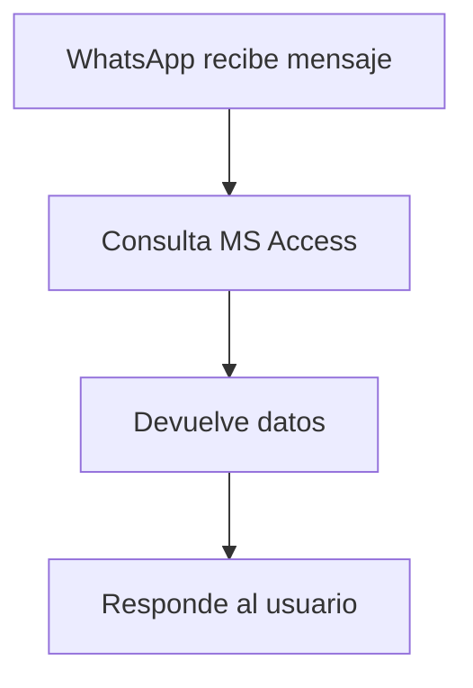

# mi-bot-whatsapp

---

## Recomendación Inicial

1. Si es para aprender o un proyecto personal pequeño: Prueba la librería whatsapp-web.js. Es compatible con Node.js/Express y es la forma más rápida de "atrapar" mensajes mediante eventos.

2. Si es para algo profesional o empresarial: Usa la API oficial de WhatsApp Business. Es la única forma legal, segura y estable de recibir mensajes en tu propia aplicación de Next.js o React mediante Webhooks.

### Paso 1: Requisitos previos

Necesitas tener instalado Node.js en tu computadora. Crea una carpeta para tu proyecto y ejecuta lo siguiente en tu terminal para iniciar el proyecto e instalar las librerías necesarias:

```bash
mkdir mi-bot-whatsapp
cd mi-bot-whatsapp
npm init -y
pnpm add whatsapp-web.js qrcode-terminal express -E
```

* ``whatsapp-web.js``: El motor que interactúa con WhatsApp.

* ``qrcode-terminal``: Para mostrar el código QR en la terminal y loguearte.

* ``express``: Para que tu servidor pueda exponer una API o mantenerse activo.

### Paso 2: El código del servidor (**`index.js`**)

Crea un archivo llamado index.js y pega el siguiente código:

```js
const { Client, LocalAuth } = require('whatsapp-web.js');
const qrcode = require('qrcode-terminal');
const express = require('express');

const app = express();
const port = 3000;

// 1. Configuración del cliente de WhatsApp
const client = new Client({
    authStrategy: new LocalAuth(), // Guarda la sesión para no escanear QR siempre
    puppeteer: {
        headless: true, // Cambia a false si quieres ver el navegador abrirse
        args: ['--no-sandbox']
    }
});

// 2. Generación del código QR para el login
client.on('qr', (qr) => {
    console.log('ESCANEA ESTE QR CON TU WHATSAPP:');
    qrcode.generate(qr, { small: true });
});

// 3. Confirmación de conexión
client.on('ready', () => {
    console.log('¡Conexión exitosa! El cliente está listo.');
});

// 4. "ATRAPAR" LOS MENSAJES (El evento principal)
client.on('message', async (msg) => {
    console.log(`Mensaje recibido de ${msg.from}: ${msg.body}`);

    // Ejemplo: Responder automáticamente si dicen "Hola"
    if (msg.body.toLowerCase() === 'hola') {
        msg.reply('¡Hola! Soy un bot conectado desde Express. 🤖');
    }
    
    // Aquí podrías enviar el mensaje a una base de datos o a tu app de React vía WebSockets
});

// 5. Iniciar cliente y servidor Express
client.initialize();

app.get('/', (req, res) => {
    res.send('Servidor de WhatsApp funcionando 🚀');
});

app.listen(port, () => {
    console.log(`Servidor Express corriendo en http://localhost:${port}`);
});
```

### Paso 3: Cómo ponerlo en marcha

1. En la terminal, ejecuta: <br/> `node index.js`

---
>[!CAUTION]
>
> Ejecuto el comando pero obtengo un error:
>```bash
>Servidor Express corriendo en http://localhost:3000
>.\node_modules\.pnpm\puppeteer-core@24.36.1\node_modules\puppeteer-core\lib\cjs\puppeteer\node\BrowserLauncher.js:333
>                    throw new Error(`Could not find Chrome (ver. ${this.puppeteer.browserVersion}). This can occur if either\n` +
>                          ^
>
>Error: Could not find Chrome (ver. 144.0.7559.96). This can occur if either
> 1. you did not perform an installation before running the script (e.g. `npx puppeteer browsers install chrome`) or
> 2. your cache path is incorrectly configured (which is: C:\Users\pizah\.cache\puppeteer).
>For (2), check out our guide on configuring puppeteer at https://pptr.dev/guides/configuration.
>```
>
> Ese es un error muy común. Lo que sucede es que la librería whatsapp-web.js depende de Puppeteer, el cual necesita descargar una versión específica de Chromium (el motor de Chrome) para funcionar. Por alguna razón, la instalación automática falló o no se ejecutó.
>
>Para solucionarlo, sigue estos pasos en tu terminal (dentro de la carpeta de tu proyecto):
>
>### 1. Forzar la instalación del navegador
>
>Ejecuta el comando que el mismo error te sugiere. Esto descargará el binario necesario en la carpeta de caché que mencionas:
>
>```bash
>npx puppeteer browsers install chrome
>```
>
>### 2. Si el error persiste (Solución manual)
>
>Si el paso anterior no funciona o prefieres usar el Chrome que ya tienes instalado en tu Windows para ahorrar espacio, puedes modificar tu código en index.js para decirle a la librería dónde está tu Chrome real.
>
>Modifica la sección del cliente así:
>```JavaScript
>const client = new Client({
>    authStrategy: new LocalAuth(),
>    puppeteer: {
>        headless: true,
>        // Reemplaza esta ruta por la de tu Chrome si es distinta
>        executablePath: 'C:\\Program Files\\Google\\Chrome\\Application\\chrome.exe', 
>        args: ['--no-sandbox', '--disable-setuid-sandbox']
>    }
>});
>```
>**Nota**: Asegúrate de usar doble barra diagonal \\ en la ruta si estás en Windows.
>
>### 3. Limpieza (Si nada de lo anterior funciona)
>
>A veces la carpeta node_modules se corrompe durante la instalación de Puppeteer. Si sigues con problemas, intenta esto:
>
>Borra la carpeta node_modules y el archivo package-lock.json.
>
>Ejecuta:<br/> `pnpm install`
>
>Vuelve a ejecutar:<br/> `node index.js`
---

2. Aparecerá un código **QR gigante** en la terminal.
3. Abre WhatsApp en tu celular -> **Dispositivos vinculados** -> **Vincular un dispositivo** <br/> y escanea el código de la terminal.
4. Una vez vinculado, verás en la consola el mensaje: ¡Conexión exitosa!.


### ¿Qué pasa después? (Cómo conectar con React/Next.js)

El código de arriba solo imprime los mensajes en la consola del servidor. Si quieres que esos mensajes aparezcan en tu aplicación de **React** o **Next.js** en tiempo real, tienes dos caminos:

* **WebSockets (Socket.io)**: Es la mejor forma. Cuando el `client.on('message')` detecta un mensaje, el servidor lo "emite" por un socket y tu app de React lo "escucha" y lo muestra en pantalla inmediatamente.

* **Base de Datos**: Guardas el mensaje en MongoDB o PostgreSQL y haces que tu app de React consulte esos datos.


### Notas de seguridad y estabilidad

* **LocalAuth**: Gracias a `new LocalAuth()`, se creará una carpeta llamada `.wwebjs_auth`. No la borres, ya que contiene tu sesión para que no tengas que escanear el QR cada vez que reinicies el servidor.

* **Baneos**: No uses este script para enviar spam (mensajes masivos a personas que no te tienen en sus contactos). WhatsApp es muy estricto y podría bloquear tu número.

¿Te gustaría que te mostrara cómo añadir **Socket.io** al ejemplo anterior para enviar el mensaje directamente a tu frontend?

---

## Socket.io

¡Excelente! Al integrar **Socket.io**, crearemos un puente en tiempo real. Cuando `whatsapp-web.js` detecte un mensaje en tu servidor de Node.js, lo "gritará" inmediatamente hacia tu aplicación de React/Next.js sin que tengas que refrescar la página.

Aquí tienes la configuración necesaria:

### 1. Instalación de Socket.io

Primero, instala la librería en tu servidor:
```Bash
pnpm add socket.io -E
```

>[!WARNING]
>
> Instala pero con algunas advertencias:
>```dos
>WARN  5 deprecated subdependencies found: fluent-ffmpeg@2.1.3, fstream@1.0.12, glob@7.2.3, inflight@1.0.6, rimraf@2.7.1
>```
>```dos
>╭ Warning ───────────────────────────────────────────────────────────────────────────────────╮
>│                                                                                            │
>│   Ignored build scripts: puppeteer.                                                        │
>│   Run "pnpm approve-builds" to pick which dependencies should be allowed to run scripts.   │
>│                                                                                            │
>╰────────────────────────────────────────────────────────────────────────────────────────────╯
>

### 2. Servidor Express actualizado (index.js)

Vamos a envolver el servidor de Express con Socket.io para permitir la comunicación bidireccional:

```JavaScript
const { Client, LocalAuth } = require('whatsapp-web.js');
const qrcode = require('qrcode-terminal');
const express = require('express');
const http = require('http'); // Necesario para Socket.io
const { Server } = require('socket.io');

const app = express();
const server = http.createServer(app);
const port = 3000;

const io = new Server(server, {
  cors: {
    origin: 'http://localhost:5173', // La URL de tu app de React/Next.js
    methods: ['GET', 'POST'],
  },
});

// 1. Configuración del cliente de WhatsApp
const client = new Client({
  authStrategy: new LocalAuth(), // Guarda la sesión para no escanear QR siempre
  puppeteer: {
    headless: true, // Cambia a false si quieres ver el navegador abrirse
    //args: ['--no-sandbox'], // tengo un error asi que lo camcio
    // Reemplaza esta ruta por la de tu Chrome si es distinta
    executablePath:
      'C:\\Program Files (x86)\\Google\\Chrome\\Application\\chrome.exe',
    args: ['--no-sandbox', '--disable-setuid-sandbox'],
  },
});

// 2. Evento de conexión de Socket.io
io.on('connection', (socket) => {
  console.log('Un cliente (React) se ha conectado');
});

// 3. Generación del código QR para el login
client.on('qr', (qr) => {
  console.log('ESCANEA ESTE QR CON TU WHATSAPP:');
  qrcode.generate(qr, { small: true });
  // Opcional: Enviar el QR al frontend si quieres mostrarlo en la web
  io.emit('qr-code', qr);
});

// 4. Confirmación de conexión
client.on('ready', () => {
  console.log('¡Conexión exitosa! El cliente está listo.');
  io.emit('status', 'Conectado');
});

// 5. "ATRAPAR" LOS MENSAJES (El evento principal)
client.on('message', async (msg) => {
  console.log(`Mensaje recibido de ${msg.from}: ${msg.body}`);
  console.log(msg);

  // Ejemplo: Responder automáticamente si dicen "Hola"
  if (msg.body.toLowerCase() === 'hola') {
    msg.reply('¡Hola! Soy un bot conectado desde Express. 🤖');
  }

  // Aquí podrías enviar el mensaje a una base de datos o a tu app de React vía WebSockets
  // Enviamos el objeto del mensaje completo a React
  io.emit('new-message', {
    from: msg.from,
    body: msg.body,
    timestamp: new Date().toLocaleTimeString(),
  });
});

// 6. Iniciar cliente y servidor Express
client.initialize();

app.get('/', (req, res) => {
  res.send('Servidor de WhatsApp funcionando 🚀');
});

app.listen(port, () => {
  console.log(`Servidor Express corriendo en http://localhost:${port}`);
});
```

### 3. Creación del Frontend con **Vite**.

1. Estando en la raíz de nuestro proyecto ejecutamos este comando
usando `VITE`:
```bash
pnpm create vite@latest . --template react-ts
```
2. Esto es el resultado del proceso:
```dos
◇  Current directory is not empty. Please choose how to proceed:
│  Ignore files and continue
│
◇  Use rolldown-vite (Experimental)?:
│  No
│
◇  Install with pnpm and start now?
│  Yes
│
◇  Scaffolding project in E:\tutorials\nodejs\mi-bot-whatsapp...
│
◇  Installing dependencies with pnpm...
```
3. Crea varios archivos y cambia a **`package.json`**, le completo lo antes borrando dejando este de esta manera:
```json
{
  "name": "mi-bot-whatsapp",
  "private": true,
  "version": "1.0.0",
  "description": "Necesitas tener instalado Node.js en tu computadora. Crea una carpeta para tu proyecto y ejecuta lo siguiente en tu terminal para iniciar el proyecto e instalar las librerías necesarias:",
  "main": "index.cjs",
  "type": "module",
  "scripts": {
    "start": "node --watch index.cjs",
    "dev": "vite",
    "build": "tsc -b && vite build",
    "lint": "eslint .",
    "preview": "vite preview"
  },
  "repository": {
    "type": "git",
    "url": "git+https://github.com/JDGonzal/mi-bot-whatsapp.git"
  },
  "keywords": [],
  "author": "",
  "license": "ISC",
  "bugs": {
    "url": "https://github.com/JDGonzal/mi-bot-whatsapp/issues"
  },
  "homepage": "https://github.com/JDGonzal/mi-bot-whatsapp#readme",
  "dependencies": {
    "express": "5.2.1",
    "qrcode-terminal": "0.12.0",
    "react": "^19.2.0",
    "react-dom": "^19.2.0",
    "socket.io": "4.8.3",
    "whatsapp-web.js": "1.34.6"
  },
  "devDependencies": {
    "@eslint/js": "^9.39.1",
    "@types/node": "^24.10.1",
    "@types/react": "^19.2.5",
    "@types/react-dom": "^19.2.3",
    "@vitejs/plugin-react": "^5.1.1",
    "eslint": "^9.39.1",
    "eslint-plugin-react-hooks": "^7.0.1",
    "eslint-plugin-react-refresh": "^0.4.24",
    "globals": "^16.5.0",
    "typescript": "~5.9.3",
    "typescript-eslint": "^8.46.4",
    "vite": "^7.2.4"
  }
}
```
4. Borro la carpeta **"node_modules"**, y ejecuto en la `TERMINAL` este comando: <br/>`pnpm i`.
5. Renombro el archivo **`index.js`** por **`index.cjs`**.
6. En una `TERMINAL` ejecuto este comando: <br/>`pnpm start` <br/> Esto pone a correr el _backend_, en este caso el **express** en la ruta: <br/> `http://localhost:3000`
7. En otra `TERMINAL` pongo este comando: <br/> `pnpm dev` <br/> Así se ejecuta el _frontend_ , con **vite** y **react**, en esta _url_: <br/> `http://localhost:5173/`.
8. Corrijo el **`.gitignore`**:
```yml
# Logs
logs
*.log
npm-debug.log*
yarn-debug.log*
yarn-error.log*
pnpm-debug.log*`
# Diagnostic reports (https://nodejs.org/api/report.html)
report.[0-9]*.[0-9]*.[0-9]*.[0-9]*.json

# Runtime data
pids
*.pid
*.seed
*.pid.lock

# Directory for instrumented libs generated by jscoverage/JSCover
lib-cov

# Coverage directory used by tools like istanbul
coverage
*.lcov

# nyc test coverage
.nyc_output

# Grunt intermediate storage (https://gruntjs.com/creating-plugins#storing-task-files)
.grunt

# Bower dependency directory (https://bower.io/)
bower_components

# node-waf configuration
.lock-wscript

# Compiled binary addons (https://nodejs.org/api/addons.html)
build/Release

# Dependency directories
node_modules/
jspm_packages/

# Snowpack dependency directory (https://snowpack.dev/)
web_modules/

# TypeScript cache
*.tsbuildinfo

# Optional npm cache directory
.npm

# Optional eslint cache
.eslintcache

# Optional stylelint cache
.stylelintcache

# Optional REPL history
.node_repl_history

# Output of 'npm pack'
*.tgz

# Yarn Integrity file
.yarn-integrity

# dotenv environment variable files
.env
.env.*
!.env.example

# parcel-bundler cache (https://parceljs.org/)
.cache
.parcel-cache

# Next.js build output
.next
out

# Nuxt.js build / generate output
.nuxt
dist

# Gatsby files
.cache/
# Comment in the public line in if your project uses Gatsby and not Next.js
# https://nextjs.org/blog/next-9-1#public-directory-support
# public

# vuepress build output
.vuepress/dist

# vuepress v2.x temp and cache directory
.temp
.cache

# Sveltekit cache directory
.svelte-kit/

# vitepress build output
**/.vitepress/dist

# vitepress cache directory
**/.vitepress/cache

# Docusaurus cache and generated files
.docusaurus

# Serverless directories
.serverless/

# FuseBox cache
.fusebox/

# DynamoDB Local files
.dynamodb/

# Firebase cache directory
.firebase/

# TernJS port file
.tern-port

# Stores VSCode versions used for testing VSCode extensions
.vscode-test

# yarn v3
.pnp.*
.yarn/*
!.yarn/patches
!.yarn/plugins
!.yarn/releases
!.yarn/sdks
!.yarn/versions

lerna-debug.log*

node_modules
dist
dist-ssr
*.local

# Editor directories and files
.vscode/*
!.vscode/extensions.json
.idea
.DS_Store
*.suo
*.ntvs*
*.njsproj
*.sln
*.sw?

#Authorization WhatsApp
.wwebjs_auth/
.wwebjs_cache
```

### 4. Código básico para tu Frontend con `socket.io-client` (React/Next.js)

1. Para recibir esos mensajes en tu interfaz, necesitarás instalar socket.io-client en tu proyecto de frontend:
```Bash
pnpm add socket.io-client -E
```
2. Creamos el componente **`src\components\WhatsAppViewer.tsx`**:

```JavaScript
import { useEffect, useState } from 'react';
import io from 'socket.io-client';

interface Message {
  from: string;
  body: string;
  timestamp: string;
}

export default function WhatsAppViewer() {
  const [messages, setMessages] = useState<Message[]>([]);

  useEffect(() => {
    // Create the socket inside the effect so listeners are attached after component mounts
    const socket = io('http://localhost:3000', { transports: ['websocket'] });

    socket.on('connect', () => {
      console.log('Socket connected:', socket.id);
    });

    socket.on('connect_error', (err) => {
      console.error('Socket connect error:', err);
    });

    // Log incoming events to help debugging and normalize payload to our Message shape
    // eslint-disable-next-line @typescript-eslint/no-explicit-any
    socket.on('new-message', (data: any) => {
      console.log('Received new-message:', data);

      const message: Message = {
        from: (data?.from) ?? (data?.notifyName) ?? (data?._data?.notifyName) ?? 'unknown',
        body: data?.body ?? '',
        timestamp:
          typeof data?.timestamp === 'number'
            ? new Date(data.timestamp * 1000).toLocaleString()
            : data?.timestamp ?? (data?.t ? new Date(data.t * 1000).toLocaleString() : new Date().toLocaleString()),
      };

      setMessages((prev) => [...prev, message]);
    });

    return () => {
      // Remove listeners and disconnect to avoid leaking sockets / duplicate listeners
      socket.off('new-message');
      socket.off('connect');
      socket.off('connect_error');
      socket.disconnect();
    };
  }, []);

  return (
    <div>
      <h1>Mensajes de WhatsApp en vivo</h1>
      <ul>
        {messages.map((m, i) => (
          <li key={i}>
            <strong>{m.from}:</strong> {m.body} <small>{m.timestamp}</small>
          </li>
        ))}
      </ul>
    </div>
  );
}
```

### ¿Qué logramos con esto?

1.Tu servidor Node.js actúa como el "cerebro" que lee WhatsApp.
2. **Socket.io** actúa como el "cable" que conecta el cerebro con tu interfaz visual.
3. Cada vez que llega un mensaje (como los que se ven en tu [WhatsApp](https://web.whatsapp.com/)), este aparecerá automáticamente en tu lista de React.

---

## Leer los mensajer recibidos y generados

Sí, es totalmente posible. Con la librería **`whatsapp-web.js`**, puedes capturar no solo los mensajes que recibes de otros, sino también los mensajes que tú mismo envías desde cualquier otro dispositivo vinculado (como tu celular o la aplicación de escritorio).

Para lograr esto, solo necesitas añadir un evento adicional a tu archivo **`index.cjs`**. Actualmente estás usando client.on('message', ...), que solo se activa con mensajes entrantes. El evento que necesitas para los mensajes que tú envías es `message_create`.

### 1. Actualización en tu **`index.cjs`** (Servidor)

Añade este bloque de código debajo de tu actual `client.on('message', ...)`:

```JavaScript
// Este evento detecta TODOS los mensajes: los que recibes y los que ENVÍAS
client.on('message_create', async (msg) => {
    // msg.fromMe es true si el mensaje lo enviaste tú desde cualquier dispositivo
    if (msg.fromMe) {
        console.log(`Mensaje enviado por mí desde otro dispositivo: ${msg.body}`);

        // Enviamos el mensaje al frontend vía Socket.io
        io.emit('new-message', {
            from: 'Yo', // O puedes usar msg.to para saber a quién se lo enviaste
            body: msg.body,
            timestamp: new Date().toLocaleTimeString(),
            isMine: true // Útil para darle un estilo diferente en React
        });
    }
});
```

### 2. ¿Por qué funciona así?

* **`message` vs `message_create`**: El evento `message` se dispara únicamente cuando entra algo nuevo a tu bandeja de entrada de otra persona. El evento `message_create` se dispara cada vez que se crea un mensaje en el ecosistema de tu cuenta, sin importar el origen.

* **Sincronización**: Como WhatsApp Web mantiene sincronizados todos los chats, cuando escribes algo en tu teléfono, el "navegador invisible" que corre en tu servidor de Express detecta esa actualización casi instantáneamente y dispara el evento.

### 3. Ajuste sugerido en el Frontend (React)

Si decides enviar la propiedad `isMine: true` como puse en el ejemplo, podrías mejorar tu componente para que los mensajes se vean distintos (como en WhatsApp real):

```JavaScript
// En tu mapeo de mensajes en React
{messages.map((m, i) => (
  <li key={i} style={{ textAlign: m.isMine ? 'right' : 'left', color: m.isMine ? 'blue' : 'black' }}>
    <strong>{m.from}:</strong> {m.body}
  </li>
))}
```
Con este cambio, tu aplicación de Node/React será un reflejo fiel de todo lo que pase en tu cuenta, permitiéndote "atrapar" tanto lo que te dicen como lo que tú respondes desde el móvil.

---

## OCR (Reconocimiento Óptico de Caracteres)


Para procesar imágenes y aplicar OCR (Reconocimiento Óptico de Caracteres) dentro de tu servidor de Node.js, la herramienta estándar y más sencilla es **`Tesseract.js`**.

Como estás usando `whatsapp-web.js`, el flujo consiste en detectar si el mensaje tiene una imagen, descargarla y luego pasarla por el motor de OCR.

### 1. ✅ Instalación de la librería

Primero, añade **Tesseract** a tu proyecto:

```Bash
pnpm add tesseract.js -E
```

### 2. ✅ Detectar mensajes con imagen en WhatsApp

En `whatsapp-web.js` debes escuchar los mensajes y verificar si tienen media:
```js
client.on('message', async (msg) => {
  if (msg.hasMedia) {
    const media = await msg.downloadMedia()
    console.log('Imagen recibida')
  }
})
```

### 3. ✅ Convertir la imagen a buffer

**Tesseract** trabaja mejor con buffer o archivo.
```js
const buffer = Buffer.from(media.data, 'base64')
```
Ahora ya tienes la imagen lista para OCR.

### 4. ✅ Ejecutar _OCR_ con **Tesseract**

Importa tesseract:
```js
const Tesseract = require('tesseract.js')
```

Luego:
```js
const result = await Tesseract.recognize(buffer, 'eng', {
  logger: m => console.log(m) // progreso opcional
})

const texto = result.data.text
console.log('Texto detectado:', texto)
```

### 5. ✅ Extraer SOLO números

Si quieres números más que texto:
```js
const numeros = texto.match(/\d+/g)
console.log('Números detectados:', numeros)
```
Eso devuelve:
```css
["123", "456", "789"]
```
Si no encuentra nada → `null`.

### 6. 🔥 Ejemplo completo integrado

Pon esto dentro de tu index.cjs:
```js
const Tesseract = require('tesseract.js')

client.on('message', async (msg) => {
  if (!msg.hasMedia) return

  try {
    const media = await msg.downloadMedia()
    const buffer = Buffer.from(media.data, 'base64')

    const result = await Tesseract.recognize(buffer, 'eng',{
      logger: m => console.log(m) // progreso opcional
    })
    const texto = result.data.text

    const numeros = texto.match(/\d+/g)

    if (numeros) {
      await msg.reply(`Números detectados: ${numeros.join(', ')}`)
    } else {
      await msg.reply('No detecté números en la imagen')
    }

  } catch (err) {
    console.error(err)
    msg.reply('Error leyendo la imagen')
  }
})
```

### 7.⚡ Mejora importante (recomendado)

Para OCR de números, usa whitelist:
```js
const result = await Tesseract.recognize(buffer, 'eng', {
  tessedit_char_whitelist: '0123456789'
})
```

Esto le dice a **Tesseract**:

👉 “Ignora letras, solo números”

Aumenta muchísimo la precisión.

### 8. Enviamos el objeto del mensaje completo a React

```js
      io.emit('new-message', {
        to: msg.to,
        from: msg.from,
        body: numeros.join(', '),
        timestamp: new Date().toLocaleTimeString(),
      });
```

---

## Flujo conversacional + Estado por usuario.

WhatsApp no tiene “popups”, así que se simula una pantalla preguntando y esperando respuesta.


### 🧠 Concepto clave: estado por usuario

Necesitas un “almacén” de memoria temporal:
```js
const estados = new Map()
```

Cada usuario tendrá algo como:
```js
{
  esperandoConfirmacion: true,
  numeros: [...],
  buffer: imagenOriginal
}
```

### ✅ Paso 1 — Cuando detectas números → preguntar

Modifica tu código OCR:
```js
const numeros = texto.match(/\d+/g)

if (numeros) {
  estados.set(msg.from, {
    esperandoConfirmacion: true,
    numeros,
    buffer
  })

  await msg.reply(
    `Números detectados: ${numeros.join(', ')}\n\n¿Están correctos? S/N`
  )
}
```

### ✅ Paso 2 — Capturar respuesta del usuario

ANTES del OCR, agrega este bloque al listener:
```js
client.on('message', async (msg) => {

  const estado = estados.get(msg.from)

  // Si está esperando confirmación
  if (estado?.esperandoConfirmacion) {

    const respuesta = msg.body.trim().toLowerCase()

    if (respuesta === 's') {
      estados.delete(msg.from)
      return msg.reply('✅ Confirmado. Guardado.')
    }

    if (respuesta === 'n') {
      await msg.reply('🔄 Reintentando lectura girando imagen...')
      return reprocesarImagen(msg, estado)
    }

    return msg.reply('Responde S o N')
  }

  // ---- Aquí sigue tu lógica normal de OCR ----
})
```

### ✅ Paso 3 — Reprocesar girando la imagen

Necesitas una librería para rotar imágenes:

👉 instala:
```bash
pnpm add sharp -E
```
>[!WARNING]
>
>**Aparece este mensaje después de la instalación:**
>```dos
>╭ Warning ───────────────────────────────────────────────────────────────────────────────────╮
>│                                                                                            │
>│   Ignored build scripts: sharp.                                                            │
>│   Run "pnpm approve-builds" to pick which dependencies should be allowed to run scripts.   │
>│                                                                                            │
>╰────────────────────────────────────────────────────────────────────────────────────────────╯
>```
>1. Entonces probamos el comando:
>```bash
>pnpm approve-builds
>```
>2. Me aparecen estas estas opciones:
>```dos
>? Choose which packages to build (Press <space> to select, <a> to toggle all, <i> to invert selection) ... 
>❯ ○ sharp
>```
>3. Le damos a la [`Space-Bar`] y la tecla [`ENTER`] <br/>
>Nos pregunta:
>```dos
>Do you approve? (y/N) » false
>```
>4. Le damos la tecla [`y`] <br/>
>y al final aparece:
>```dos
>node_modules/.pnpm/sharp@0.34.5/node_modules/sharp: Running install script, done in 785ms
>```


Luego:
```js
const sharp = require('sharp')
const Tesseract = require('tesseract.js')
```

Función:
```js
async function reprocesarImagen(msg, estado) {
  try {
    const rotada = await sharp(estado.buffer)
      .rotate(90)
      .toBuffer()

    const result = await Tesseract.recognize(rotada, 'eng', {
      tessedit_char_whitelist: '0123456789'
    })

    const texto = result.data.text
    const numeros = texto.match(/\d+/g)

    estados.set(msg.from, {
      esperandoConfirmacion: true,
      numeros,
      buffer: rotada
    })

    await msg.reply(
      `Nueva lectura: ${numeros?.join(', ') || 'Nada detectado'}\n\n¿Correcto? S/N`
    )

  } catch (err) {
    console.error(err)
    msg.reply('Error reprocesando imagen')
  }
}
```

### 🚀 Extra pro (opcional)

Puedes intentar múltiples rotaciones:
```js
.rotate(180)
.rotate(270)
```

Hasta encontrar la mejor lectura.

O guardar historial:
```makefile
intentos: 1, 2, 3...
```

### Cambios como validar imagenes y si validar textos

1. No me interesa hacer revalidación de las imágenes, por ende no requerimos el `sharp`, entonces desinstalo la librería : <br/> `pnpm remove sharp`
2. Quitamos del código la importación de `sharp`, la función que la usa:
```js
// const sharp = require('sharp');
...
// ===== Reprocesar imagen rotada =====
// async function reprocesarImagen(msg, estado) {
//   try {
//     const rotada = await sharp(estado.buffer).rotate(90).toBuffer();

//     const numeros = await leerNumeros(rotada);

//     estados.set(msg.from, {
//       esperandoConfirmacion: true,
//       numeros,
//       buffer: rotada,
//     });

//     await msg.reply(
//       `Nueva lectura: ${numeros?.join(', ') || 'Nada detectado'}\n\n¿Correcto? S/N`,
//     );
//   } catch (err) {
//     console.error(err);
//     msg.reply('Error reprocesando imagen');
//   }
// }
...
    if (respuesta === 'n' || respuesta === 'no') {
      // await msg.reply('🔄 Girando imagen y reintentando...');
      // return reprocesarImagen(msg, estado);
      return msg.reply(`Sugerencia: 
        1. Mejora la imagen y envia de nuevo. 
        2. O digita la lista de números separados por comas.`);
    }
```
3. Añadimos la validación de números que se digitan:
```js
  const texto = msg.body;
  const numeros = texto.match(/\d+/g);
  const estado = estados.get(msg.from);

  if (numeros) {
    estados.set(msg.from, {
      esperandoConfirmacion: true,
      numeros,
      texto,
    });
    console.log(`Números detectados: ${numeros.join(', ')}`);
    return msg.reply(
      `Números detectados: ${numeros.join(', ')}\n\n¿Están correctos? S/N`,
    );
  }
```
4. Se borra el archivo no necesario de **`pnpm-workspace.yaml`**.
5. Se renombra el actual **`index.cjs`** a **`index-express-socket-io.cjs`**.
6. Se crea el archivo simple de **`index.cjs`**:
```js
const { Client, LocalAuth } = require('whatsapp-web.js');
const qrcode = require('qrcode-terminal');
const Tesseract = require('tesseract.js');

// ===== Estado por usuario =====
const estados = new Map();

// ===== Cliente WhatsApp =====
const client = new Client({
  authStrategy: new LocalAuth(), // Guarda la sesión para no escanear QR siempre
  puppeteer: {
    headless: true, // Cambia a false si quieres ver el navegador abrirse
    //args: ['--no-sandbox'], // tengo un error asi que lo camcio
    // Reemplaza esta ruta por la de tu Chrome si es distinta
    executablePath:
      'C:\\Program Files (x86)\\Google\\Chrome\\Application\\chrome.exe',
    args: ['--no-sandbox', '--disable-setuid-sandbox'],
  },
});

client.on('qr', (qr) => {
  qrcode.generate(qr, { small: true });
  console.log('Escanea el QR');
});

client.on('ready', () => {
  console.log('Bot listo ✅');
});

// ===== Función OCR =====
async function leerNumeros(buffer) {
  const result = await Tesseract.recognize(buffer, 'eng', {
    tessedit_char_whitelist: '0123456789',
  });

  const texto = result.data.text;
  return texto.match(/\d+/g);
}


// ===== Listener principal =====
client.on('message', async (msg) => {
  console.log(`Mensaje recibido de ${msg.from}: ${msg.body}`);
  // Ejemplo: Responder automáticamente si dicen "Hola"
  if (msg.body.toLowerCase() === 'hola') {
    return msg.reply(
      '¡Hola! \n Por favor digita los números de las boletas separados por comas o envía una imagen con los números visibles en forma horizontal.',
    );
  }

  const texto = msg.body;
  const numeros = texto.match(/\d+/g);
  const estado = estados.get(msg.from);

  if (numeros) {
    estados.set(msg.from, {
      esperandoConfirmacion: true,
      numeros,
      texto,
    });
    console.log(`Números detectados: ${numeros.join(', ')}`);
    return msg.reply(
      `Números detectados: ${numeros.join(', ')}\n\n¿Están correctos? S/N`,
    );
  }
  // ===== Caso: esperando confirmación =====
  if (await estado?.esperandoConfirmacion) {
    const respuesta = msg.body.trim().toLowerCase();

    if (
      respuesta === 's' ||
      respuesta === 'si' ||
      respuesta === 'y' ||
      respuesta === 'yes'
    ) {
      console.log(`✅ Confirmado. Guardado de ${msg.from}`);
      console.log(estado.numeros.join(', '))
      estados.delete(msg.from);
      
      return msg.reply('✅ Confirmado. Guardado.');
    }

    if (respuesta === 'n' || respuesta === 'no') {
      return msg.reply('*Sugerencia*:\n1️⃣ Mejora la imagen y envía de nuevo.\n2️⃣ O digita la lista de números separados por comas.');
    }

    return msg.reply('Responde S o N');
  }

  // ===== Caso: mensaje con imagen =====
  if (msg.hasMedia) {
    try {
      const media = await msg.downloadMedia();
      const buffer = Buffer.from(media.data, 'base64');

      const numeros = await leerNumeros(buffer);

      if (!numeros) {
        return msg.reply('No detecté números en la imagen');
      }

      estados.set(msg.from, {
        esperandoConfirmacion: true,
        numeros,
        buffer,
      });
      console.log(`Números detectados: ${numeros.join(', ')}`);
      return msg.reply(
        `Números detectados: ${numeros.join(', ')}\n\n¿Están correctos? S/N`,
      );
    } catch (err) {
      console.log('Error leyendo la imagen');
      console.error(err);
      msg.reply('Error leyendo la imagen');
    }
  }
});

client.initialize();
```
---

## Almacenamiento en MS Access

Sí — se puede, pero **MS Access** es especial porque no es un motor de base de datos tradicional. **Node.js** no tiene soporte nativo directo; se usa un driver puente vía _ODBC_ o _ADO_.

Te explico las opciones reales y cuál conviene 👇

### ✅ Opción recomendada: `node-adodb` (Windows)

Funciona usando el motor _ADO_ de Windows.

👉 Requisito: estar en Windows con Access instalado<br/>
👉 Funciona muy bien con .mdb y .accdb

### 🔹 Paso 1 — Instalar librería

```bash
pnpm add node-adodb -E
```

### 🔹 Paso 2 — Importar en index.cjs

```js
const ADODB = require('node-adodb')
ADODB.debug = true
```

### 🔹 Paso 3 — Conectar base de datos

1. Antes de esto creamos el archivo **`.env`**, con la ruta de la base de datos de MSAccess.
2. Requerimos o instalar `dotenv`: <br/> `pnpm add dotenv -E` <br/> o cambir en el _script_ el `"start"` por est líne <br/> `"node --watch --env-file=.env index.cjs"` <br/> Pero infortunadamente el último no funciona correctamente, entonces procedo con la primera instalación.
3. Añado esta importación
```js
const dotenv = require('dotenv');
dotenv.config();
```
4. Y puedo utilizar una variable de ambiente.

Ruta absoluta del archivo:
```js
const connection = ADODB.open(
  'Provider=Microsoft.ACE.OLEDB.16.0;Data Source=C:\\ruta\\tu_db.accdb;Persist Security Info=False;'
)
```

Ejemplo real:
```js
const connection = ADODB.open(
  'Provider=Microsoft.ACE.OLEDB.16.0;Data Source=C:\\db\\clientes.accdb;'
)
```

### 🔹 Paso 4 — Verificando Conexión a la BD de MSAccess

Validamos que si tengamos una conexión correcta a la BD de MSAccess con esta función:

```js
async function probarConexionMSAccess() {
  const testQuery = 'SELECT 1 AS ok';
  try {
    const test = await connection.query(testQuery);
    console.log('✅ Conexión exitosa a MSAccess:', test);
    return true;
  } catch (err) {
    console.error('❌ Error de conexión:');
    connection
      .query(testQuery)
      .then((data) => console.log('OK:', data))
      .catch((err) => console.error(err));
    return false;
  }
}
```

### 🔹 Paso 5 — Llamar la función cuando se habilita el _bot_

```js
client.on('ready', async () => {
  console.log('✅ Bot listo y conectado a WhatsApp.');
  probarConexionMSAccess();
});
```
Pero tengo este error:
```diff
- process: {
-    code: -2146824582,
-    message: 'Provider cannot be found. It may not be properly installed.'
-  }
```

>[!CAUTION]
>
>Perfecto — ese error ya nos dice exactamente qué pasa:
>
>`Provider cannot be found. It may not be properly installed.`
>
>👉 Node sí está funcionando<br/>
>👉 ADODB sí está funcionando<br/>
>👉 Lo que falta es el driver de Access<br/>
>
>No es un error de código. Es 100% entorno Windows.
>
>### 🔥 Causa real
>
>Tu sistema no tiene instalado:
>
>👉 Microsoft Access Database Engine
>
>o está instalado en arquitectura incorrecta.
>
>### ✅ Solución correcta (paso a paso)
>
>**1️⃣ Ver arquitectura de Node**
>
>En terminal:
>```code
>node -p process.arch
>```
>Resultado típico: `x64` o `ia32`.
>
>**2️⃣ Descargar Access Engine correcto**
>
>Descarga oficial:
>
>👉 [Microsoft Access Database Engine 2016 Redistributable](https://www.microsoft.com/en-us/download/details.aspx?id=54920)
>
>Debes elegir:
>
>* **`AccessDatabaseEngine_X64.exe`**
>* **`AccessDatabaseEngine.exe`** (x86)
>
>👉 debe coincidir con Node

>[!TIP]
>
>### En mi caso pese a que la arquitectura reportada es `x64`, me permitió instalar **`AccessDatabaseEngine.exe`** y con esto el proceso funcionó.


### 🔹 Paso 6 — Usarlo dentro del bot

1. Creamos la tabla `CELULARES`:
```sql
CREATE TABLE CELULARES (
    ID AUTOINCREMENT PRIMARY KEY,
    MESSAGE_FROM VARCHAR(32) NOT NULL,
    USER_NAME VARCHAR(64) NOT NULL,
    CELLPHONE VARCHAR(16) UNIQUE NOT NULL,
    created_at TIMESTAMP DEFAULT NOW(),
    updated_at TIMESTAMP 
);
```
2. Creamos la función que será llamada desde el método `probarConexionMSAccess()`:
```js
async function crearTablaCelulares() {
  const createTableQuery = `
CREATE TABLE CELULARES (
    ID AUTOINCREMENT PRIMARY KEY,
    MESSAGE_FROM VARCHAR(32) NOT NULL,
    USER_NAME VARCHAR(64) NOT NULL,
    CELLPHONE VARCHAR(16) UNIQUE NOT NULL,
    created_at TIMESTAMP DEFAULT NOW(),
    updated_at TIMESTAMP 
);`;

  await connection
    .query(createTableQuery)
    .then(() => console.log('✅ Tabla "CELULARES" creada.'))
    .catch((err) => {
      msg = err?.process?.message ?? String(err);
      if (msg.toLowerCase().includes('already exists'))
        console.error('✅ Tabla "CELULARES" Lista.');
      else if (msg.toLowerCase().includes('object is closed'))
        console.log('✅ Tabla "CELULARES" creada.');
      else console.error(`❌ ${msg}`);
    });
}
```
3. Verificar que exista el número celular en la tabla:
```js
async function VerificarCelularEnBaseDeDatos(from) {
  const query1 = `SELECT COUNT(*) AS [Found] 
    FROM [CELULARES] 
    WHERE [MESSAGE_FROM] = '${from}';`;
  const query2 = `SELECT TOP 1 * 
    FROM [CELULARES] 
    WHERE [MESSAGE_FROM] = '${from}';`;
  const estado = estados.get(from);
  if ((await from) === 'status@broadcast') {
    estados.delete(from);
    return null;
  }
  try {
    const result = await connection.query(query1);
    if (result[0]?.Found > 0) {
      const data = await connection.query(query2);
      return data;
    } else {
      if (await estado?.esperandoCelular) return;
      console.log('❌ Número no encontrado en la base de datos:', result);
      return null;
    }
  } catch (err) {
    if (await estado?.esperandoCelular) return;
    console.error('❌ Error verificando número en la base de datos:', err);
    return null;
  }
}
```
4. Preguntar por el número celular y almacenar el estado:
```js
  console.log(`Mensaje recibido de ${msg.from}: ${msg.body}`);
  ...
  const data = await VerificarCelularEnBaseDeDatos(msg.from);
  ...
  if (
    !(await estado?.esperandoCelular) &&
    !(await estado?.esperandoConfirmacion)
  ) {
    // Verificamos primer si existe el número celular
    if (!data || data[0]?.Found === 0) {
      estados.set(msg.from, {
        esperandoCelular: true,
        cellphone: null,
        username: msg._data.notifyName || 'Desconocido',
      });
      return msg.reply(
        '¡Hola! \n🖐️No estás registrado.\nPor favor, envía tu número de celular para registrarte.',
      );
    } else {
      console.log(
        `✅ Celular número: ${data[0]?.CELLPHONE} de ${data[0]?.USER_NAME}`,
      );
    }
  }
```
5. Almacenar el número celular en la tabla:
```js
async function guardarCelularEnBaseDeDatos(from, nombreUsuario, celular) {
  const insertQuery = `
INSERT INTO [CELULARES] ([MESSAGE_FROM], [USER_NAME], [CELLPHONE])
    VALUES ('${from}', '${nombreUsuario}', '${celular}');`;

  try {
    await connection.query(insertQuery);
    console.log(`✅ Celular ${celular} guardado en la base de datos.`);
    return true;
  } catch (err) {
    if (await VerificarCelularEnBaseDeDatos(from)) {
      return true;
    } else {
      console.error(`❌ Error guardando celular en la base de datos: ${err}`);
      return false;
    }
  }
}
```
6. Y esperar por el estado y validación del número para solicitar guardarlo en la BD:
```js
if (await estado?.esperandoCelular) {
    const regexCelular = /^\d{10}$/; // Ajusta el rango según tus necesidades
    const celular = msg.body.trim().toLowerCase();

    if (
      regexCelular.test(celular) &&
      !isNaN(celular) &&
      celular.length === 10 &&
      celular[0] === '3'
    ) {
      estados.set(msg.from, {
        esperandoCelular: true,
        cellphone: celular,
        username: msg._data.notifyName || 'Desconocido',
      });
      const { cellphone, username } = estados.get(msg.from);
      if (await guardarCelularEnBaseDeDatos(msg.from, username, cellphone)) {
        console.log(
          `✅ Confirmado. Guardado de ${username} con celular ${cellphone}`,
        );
        estados.delete(msg.from);
      } else {
        return msg.reply(
          '❌ Error guardando el número en la base de datos. Intenta de nuevo más tarde.',
        );
      }
    } else {
      return msg.reply(
        'Número de celular no válido. Por favor, envía un número de 10 dígitos, sin espacios, sin guiones. \nEjemplo: 3876543210',
      );
    }

    return msg.reply(
      '✅ Confirmado. Guardado. \n\n➡️ Ahora puedes enviar los números de las boletas o una imagen con los números visibles en forma horizontal.',
    );
  }
```
7. Creamos la tabla `REGISTROS`:
```sql
CREATE TABLE REGISTROS (
    IDUNIX VARCHAR(15) NOT NULL,
    CELLPHONE DOUBLE NOT NULL,
    BONO INT NOT NULL,
    created_at TIMESTAMP DEFAULT NOW(),
    updated_at TIMESTAMP,
    CONSTRAINT PK_REGISTROS PRIMARY KEY (CELLPHONE, BONO)
);
```
8. Creamos la función que será llamada desde el método `probarConexionMSAccess()`:
```js
async function crearTablaRegistros() {
  const createTableQuery = `
CREATE TABLE REGISTROS (
    IDUNIX VARCHAR(15) NOT NULL,
    CELLPHONE DOUBLE NOT NULL,
    BONO INT NOT NULL,
    created_at TIMESTAMP DEFAULT NOW(),
    updated_at TIMESTAMP,
    CONSTRAINT PK_REGISTROS PRIMARY KEY (CELLPHONE, BONO)
);`;

  await connection
    .query(createTableQuery)
    .then(() => console.log('✅ Tabla "REGISTROS" creada.'))
    .catch((err) => {
      msg = err?.process?.message ?? String(err);
      if (msg.toLowerCase().includes('already exists'))
        console.error('✅ Tabla "REGISTROS" Lista.');
      else if (msg.toLowerCase().includes('object is closed'))
        console.log('✅ Tabla "REGISTROS" creada.');
      else console.error(`❌ ${msg}`);
    });
}
```
9. Ya hicimos el proceso de cargar en memoria una vez los números de bonos o boletas están registrados, se hace la pregunta de que sei están correctoy si la respuesta es afirmativa se graba en BD, en la tabla `REGISTROS`:
```js
async function guardarRegistrosEnBaseDeDatos(from) {
  let estado = estados.get(from);
  if (!estado || !estado.numeros || !estado.cellphone) {
    console.error('Estado incompleto para guardar registros:', {
      from,
      estado,
    });
    return false;
  }

  console.log('numeros (inicio):', estado.numeros.join(', '));

  // Trabajamos sobre una copia para evitar problemas al modificar la lista mientras iteramos
  const snapshot = Array.isArray(estado.numeros) ? [...estado.numeros] : [];

  for (const num of snapshot) {
    const unixTimestamp = Math.floor(Date.now());
    const cleaned = (num || '').toString().trim();
    const insertQuery = `INSERT INTO [REGISTROS] ([IDUNIX],[CELLPHONE],[BONO]) VALUES ('${unixTimestamp}', ${estado.cellphone}, ${cleaned});`;

    console.log('sql:', insertQuery);

    try {
      const data = await connection.query(insertQuery);
      console.log('✅ MSAccess OK:', data);
    } catch (err) {
      const msg = err?.process?.message ?? String(err);

      // Si es un duplicado, actualizamos el estado eliminando ese número y continuamos
      if (typeof msg === 'string' && msg.toLowerCase().includes('duplicate')) {
        // Re-lee el estado actual del Map por si cambió mientras iterábamos
        const current = estados.get(from) || estado;
        const updatedNumeros = (current.numeros || []).filter((n) => n !== num);
        estados.set(from, { ...current, numeros: updatedNumeros });
        console.log('Duplicado detectado, eliminado del estado:', num);
        console.log(
          'Números actuales (post-eliminación):',
          updatedNumeros.join(', '),
        );
        // Actualiza variable local para reflejar el cambio en esta iteración
        estado = estados.get(from) || estado;
        continue;
      }
      if (!msg.toLowerCase().includes('object is closed')) {
        console.error(msg);
      }
    }
  }
  return true;
}
```
10. Devemos verificar lo guardado en la tabla de `REGISTROS`:
```js
async function VerificarRegistrosEnBaseDeDatos(from) {
  const { cellphone, numeros, unixTimestamp } = estados.get(from);
  const query = `SELECT * 
    FROM [REGISTROS] 
    WHERE [CELLPHONE] = ${cellphone}
    AND ([BONO] IN (${numeros.join(',')})
    OR [IDUNIX] >= '${unixTimestamp}');`;

  const estado = estados.get(from);
  try {
    const data = await connection.query(query);

    if (!data[0]) {
      if (await estado?.esperandoConfirmacion) return;
      console.log('❌ Números no encontrados en la base de datos:', data);
      return null;
    }
    return data;
  } catch (err) {
    if (await estado?.esperandoConfirmacion) return;
    console.error('❌ Error verificando números en la base de datos:', err);
    return null;
  }
}
```
11. El llamado de esta nueva función es dentro de haber recibido una respuesta positiva:
```js
if (await estado?.esperandoConfirmacion) {
    const respuesta = msg.body.trim().toLowerCase();

    if (
      respuesta === 's' ||
      respuesta === 'si' ||
      respuesta === 'y' ||
      respuesta === 'yes'
    ) {
      if (await guardarRegistrosEnBaseDeDatos(msg.from)) {
        const data = await VerificarRegistrosEnBaseDeDatos(msg.from);
        const numerosGuardados = data.map((item) => item?.BONO);
        console.log(
          `✅ Confirmado. Guardado de ${estado.cellphone} los números: ${numerosGuardados.join(', ')}`,
        );
        await msg.reply(
          `✅ Confirmado.\nGuardado de ${estado.cellphone} los números:\n* ${numerosGuardados.join('\n* ')}\nNúmero que no esté en esta lista es por ser duplicado o haberse guardado previamente.\n\n⚠️La validación final esta sujeta revisiones manuales posteriores.`,
        );
        estados.delete(msg.from);
        return true;
      }
    }
    if (respuesta === 'n' || respuesta === 'no') {
      return msg.reply(
        '*Sugerencia*:\n1️⃣ Mejora la imagen y envía de nuevo.\n2️⃣ O digita la lista de números separados por comas.',
      );
    }

    return msg.reply('Responde S o N');
  }
```

### 🔥 Flujo completo


```mermaid
flowchart TD
    A[WhatsApp recibe mensaje] --> B[Consulta MS Access]
    B --> C[Devuelve datos]
    C --> D[Responde al usuario]
```

>[!Important]
>
>Esto solo funciona si:
>
>✅ Windows<br/>
>✅ Access Database Engine instalado<br/>
>✅ Archivo local accesible<br/>
>✅ Ruta absoluta correcta

>[!Warning]
>Si falla, instala:
>
>👉 Microsoft Access Database Engine 2016 Redistributable
>
>🟢 Alternativa multiplataforma: mdb-reader
>

>[!TIP]
>
>### 📖 Si quieres solo leer (no escribir):
>
>Instala esta otra librería
>```nginx
>pnpm add mdb-reader
>```
>
>Haz como este ejemplo:
>```js
>const MDBReader = require('mdb-reader')
>const fs = require('fs')
>
>const buffer = fs.readFileSync('db.mdb')
>const reader = new MDBReader(buffer)
>
>const tabla = reader.getTable('clientes')
>console.log(tabla.getData())
>```
>
>👉 No requiere Windows<brt/>
>👉 Solo lectura<br/>
>👉 Muy rápido<br/>

>[!NOTE]
>
>### 🚀 Nivel profesional
>
>Puedes combinar:
>```mermaid
>flowchart TD
>    A[OCR: números detectados] --> B[Buscar en MS Access]
>    B --> C[Validar cliente / factura]
>    C --> D[Responder automáticamente]
>```
>
>Ejemplo:
>```yaml
>Número detectado: 12345
>Cliente encontrado: Juan Pérez
>Saldo: $500
>```

---

## Sugerencia de ChatGPT para pruebas unitarias

Sí — se pueden y se deben 😄
Aunque tu archivo sea un bot + OCR + DB, puedes testear la lógica si separas responsabilidades.

Ahora mismo tu index.cjs mezcla:

👉 WhatsApp<br/>
👉 OCR<br/>
👉 Access<br/>
👉 estado conversacional<br/>

Eso es difícil de testear directo.

La clave es:

>extraer funciones puras y mockear dependencias

### ✅ Qué partes sí se pueden testear

Estas son las mejores candidatas:

#### 1. OCR → extracción de números

Función:
```js
leerNumeros(buffer)
```
Test:

✔ detecta números<br/>
✔ ignora texto<br/>
✔ retorna null si no hay números<br/>

#### 2. Estado conversacional

Mapa:
```js
estados
```
Tests:

✔ guarda estado<br/>
✔ cambia a confirmado<br/>
✔ elimina estado<br/>
✔ maneja respuesta inválida<br/>

#### 3. Parser de respuestas S/N

Función sugerida:
```js
function interpretarRespuesta(texto) {
  const r = texto.trim().toLowerCase()
  if (r === 's') return 'ok'
  if (r === 'n') return 'retry'
  return 'invalid'
}
```
Test:

✔ "S" → ok<br/>
✔ "n" → retry<br/>
✔ basura → invalid<br/>

#### 4. Query builder Access

Si construyes SQL dinámico:

✔ escapa valores<br/>
✔ encierra columnas en []<br/>
✔ evita SQL injection<br/>

### 🔥 Qué NO testear directamente

❌ WhatsApp real<br/>
❌ Access real<br/>
❌ Tesseract real<br/>

Eso se mockea.

Los unit tests no deben depender de:

* red
* drivers
* archivos reales
* WhatsApp abierto

### ✅ Framework recomendado

Instala:
```bash
npm install --save-dev jest
```
En package.json:
```json
"scripts": {
  "test": "jest"
}
```

### 🧪 Ejemplo real de test

Archivo: **`leerNumeros.test.js`**
```js
const { interpretarRespuesta } = require('./utils')

test('interpreta S como confirmación', () => {
  expect(interpretarRespuesta('S')).toBe('ok')
})

test('interpreta n como retry', () => {
  expect(interpretarRespuesta('n')).toBe('retry')
})

test('texto inválido', () => {
  expect(interpretarRespuesta('hola')).toBe('invalid')
})
```

### ✅ Mock de OCR

```js
jest.mock('tesseract.js', () => ({
  recognize: jest.fn(() =>
    Promise.resolve({ data: { text: '123 ABC 456' } })
  )
}))
```
Test:
```js
test('extrae números', async () => {
  const nums = await leerNumeros(Buffer.from('fake'))
  expect(nums).toEqual(['123', '456'])
})
```

### 🧠 Tests que yo haría en tu proyecto

Prioridad alta:

✅ extracción de números<br/>
✅ manejo de estado por usuario<br/>
✅ confirmación S/N<br/>
✅ reprocesamiento de imagen<br/>
✅ builder SQL<br/>
✅ manejo de errores<br/>

Prioridad media:

✅ límites de reintentos<br/>
✅ limpieza de estado<br/>
✅ respuestas inválidas<br/>
✅ concurrencia de usuarios<br/>

### 🚀 Bonus profesional

Separar tu proyecto así:
```dos
bot/
ocr.js
estado.js
db.js
utils.js
index.cjs
tests/
```
Cada archivo → test independiente.

Eso convierte tu bot en software serio.

Si quieres, puedo:

✅ refactorizar tu index.cjs para testear<br/>
✅ escribir suite Jest completa<br/>
✅ mocks de WhatsApp<br/>
✅ mocks de Access<br/>
✅ cobertura 90%+<br/>
✅ pipeline CI/CD<br/>
✅ test automático en GitHub<br/>

Dime qué nivel quieres y lo armamos 😄

---

## Sugerencia de Gemini para pruebas unitarias

Añadir pruebas unitarias a un bot de WhatsApp que interactúa con bases de Datos (MS Access) y OCR es una excelente idea para evitar que cambios futuros rompan la lógica de registro o el flujo de conversación.

Para este entorno, te recomiendo usar **Jest**, que es el framework de pruebas más estándar en Node.js.

### 1. Instalación de herramientas de test

Ejecuta en tu terminal:

```Bash
npm install --save-dev jest
```

### 2. ¿Qué deberías probar? (Estrategia)

No es recomendable probar la conexión real a WhatsApp o a MS Access en pruebas unitarias (eso serian pruebas de integración). Debes probar la lógica de negocio aislando las funciones.

Los candidatos ideales para pruebas son:

1. Validación de números celulares: Que el regex funcione (10 dígitos, empieza por 3).
2. Procesamiento de texto OCR: Que el filtrado de números (match(/\d+/g)) sea correcto.
3. estión de estados: Que la lógica de "si está en estado X, responda Y" funcione.

### 3. Ejemplo de archivo de prueba (index.test.cjs)

Primero, para que las funciones sean testeables, deberías exportarlas al final de tu **`index.cjs`**:

```JavaScript
module.exports = { leerNumeros, regexCelular: /^\d{10}$/ }; // 
```
Ejemplo de exportación
Luego, crea un archivo **`test/logic.test.js`**:

```JavaScript
const { leerNumeros } = require('../index.cjs');

// Mock de Tesseract para no ejecutar el OCR real en los tests (ahorra tiempo y recursos)
jest.mock('tesseract.js', () => ({
  recognize: jest.fn().mockResolvedValue({
    data: { text: 'Hola, mi bono es 12345 y el otro 67890' }
  })
}));

describe('Pruebas de Lógica del Bot', () => {
  
  test('La función leerNumeros debe extraer solo dígitos del texto OCR', async () => {
    const fakeBuffer = Buffer.from('');
    const numeros = await leerNumeros(fakeBuffer);
    
    expect(numeros).toEqual(['12345', '67890']);
    expect(numeros).not.toContain('Hola');
  });

  test('Validación de formato de celular (Regex)', () => {
    const regexCelular = /^\d{10}$/;
    const numCorrecto = "3101234567";
    const numCorto = "310123";
    const numLetras = "310abc4567";

    expect(regexCelular.test(numCorrecto)).toBe(true);
    expect(regexCelular.test(numCorto)).toBe(false);
    expect(regexCelular.test(numLetras)).toBe(false);
  });
});
```

### 4. Pruebas de Flujo (Mocks de Base de Datos)

Dado que usas `node-adodb`, puedes probar si tu lógica de inserción maneja bien los errores. Por ejemplo, podrías simular un error de "Duplicado" en MS Access y verificar que tu función `guardarRegistrosEnBaseDeDatos` lo maneje correctamente sin detenerse.

**¿Cómo hacerlo?**

1. **Refactoriza**: Mueve la lógica de la base de datos a un archivo separado (ej. db.cjs).

2. **Inyecta dependencias**: En tus tests, sustituye connection.query por una función falsa (jest.fn()) que devuelva un error de duplicado.

### 5. Cómo ejecutar los tests

Agrega esto a tu package.json:

```JSON
"scripts": {
  "test": "jest"
}
```
Y corre: `pnpm test`.

### Recomendación de "Siguiente Paso":

Para poder hacer pruebas de alta calidad, tu archivo **`index.cjs`** está un poco "apretado" (mezcla conexión, lógica de bot y base de datos).

---

## Enviando Mensajes y reactivación de **Express**

Efectivamente, no necesitas esperar a que alguien te escriba para enviarle un mensaje. Dado que ya tienes el objeto `client` inicializado en tu **`index.cjs`**, puedes usar el método `client.sendMessage()`.

Lo único "truco" aquí es el formato del identificador. WhatsApp no usa solo el número de teléfono, sino un **JID** (_Jabber ID_), que normalmente es `número@c.us`.

Aquí tienes cómo hacerlo y cómo integrarlo en tu lógica actual:

### 1. El formato del ID

Si el número de celular es `573101234567`, para enviarle un mensaje el ID debe ser:
`573101234567@c.us`

### 2. Función para enviar mensajes (en tu **`index.cjs`**)

Puedes añadir esta función genérica para usarla en cualquier parte de tu código:

```JavaScript
async function enviarMensajeDirecto(numero, texto) {
    try {
        // Limpiamos el número por si acaso (quitar espacios o signos +)
        const numeroLimpio = numero.replace(/\D/g, ''); 
        const chatId = `${numeroLimpio}@c.us`;

        // Verificamos si el número está registrado en WhatsApp antes de enviar
        const esValido = await client.isRegisteredUser(chatId);
        
        if (esValido) {
            await client.sendMessage(chatId, texto);
            console.log(`✅ Mensaje enviado a ${numeroLimpio}`);
        } else {
            console.error('❌ El número no está registrado en WhatsApp');
        }
    } catch (err) {
        console.error('❌ Error al enviar mensaje:', err);
    }
}
```

### 3. ¿Cómo usarlo con tus datos de MS Access?

Como ya tienes una función que consulta la tabla CELULARES, podrías hacer algo así para enviar notificaciones automáticas:

```JavaScript
// Ejemplo: Notificar a un usuario específico
async function notificarUsuario(idUsuarioBaseDatos) {
    // Supongamos que obtienes el celular de tu base de datos
    // Resultado de: SELECT CELLPHONE FROM CELULARES WHERE ...
    const celular = "3001234567"; 
    
    // IMPORTANTE: Asegúrate de incluir el código de país (ej: 57 para Colombia)
    const mensaje = "¡Hola! Te recordamos que tienes boletas pendientes por registrar.";
    await enviarMensajeDirecto(`57${celular}`, mensaje);
}
```

>[!TIP]
>
>### 🧠 Detalles a tener en cuenta:
>
>* **Código de País**: `whatsapp-web.js` requiere el código de país (prefijo). Si en tu base de datos solo guardas los 10 dígitos (ej: `310...`), deberás concatenar el prefijo manualmente (ej: `57` para Colombia) antes de enviar.
>
>* **Spam**: Si envías muchos mensajes a números que no te tienen guardado en sus contactos y que nunca te han escrito antes, WhatsApp detectará tu bot rápidamente y podría banearte.
>
>* **Uso con Express**: Si quieres disparar estos mensajes desde un botón en tu frontend de React, podrías crear una ruta en Express:
>
>```JavaScript
>app.post('/enviar-alerta', async (req, res) => {
>    const { numero, mensaje } = req.body;
>    await enviarMensajeDirecto(numero, mensaje);
>    res.json({ status: 'Procesado' });
>});
>```

## Fallos en reinicio `client.on` y que toma mucho tiempo

Hazlo con reinicios controlados: crea/arranca el cliente dentro de una función que pueda destruir y recrear el cliente, usa un _timeout_ que detecte si no se recibió `'ready'` en X ms y reintente con _backoff_ exponencial. También escucha eventos como `'auth_failure'` y `'disconnected'` para reintentar.

Pegas esto (reemplaza la inicialización actual del cliente y los handlers que ya tengas; conserva las funciones auxiliares como `probarConexionMSAccess`):

```js
// Constantes
const READY_TIMEOUT_MS = 45_000; // tiempo máximo para esperar 'ready'
const RESTART_BASE_MS = 5_000; // backoff base
const RESTART_MAX_MS = 60_000;

let client = null;
let readyTimeout = null;
let restartAttempts = 0;
let shuttingDownClient = false;

function createClientInstance() {
  return new Client({
    authStrategy: new LocalAuth(),
    puppeteer: {
      headless: true,
      executablePath:
        process.env.CHROME_PATH ||
        'C:\\Program Files\\Google\\Chrome\\Application\\chrome.exe',
      args: ['--no-sandbox', '--disable-setuid-sandbox'],
    },
  });
}

function clearReadyTimer() {
  if (readyTimeout) {
    clearTimeout(readyTimeout);
    readyTimeout = null;
  }
}

function scheduleRestart(reason) {
  if (shuttingDownClient) return;
  restartAttempts++;
  const delay = Math.min(RESTART_MAX_MS, RESTART_BASE_MS * 2 ** (restartAttempts - 1));
  console.warn(`Reiniciando cliente por: ${reason}. Intento ${restartAttempts} en ${delay}ms`);
  setTimeout(() => startClient(), delay);
}

function attachClientHandlers(c) {
  // qr
  c.on('qr', (qr) => {
    console.clear();
    console.log('QR generado (muestra en consola)');
    qrcode.generate(qr, { small: true });
  });

  // ready
  c.on('ready', async () => {
    clearReadyTimer();
    restartAttempts = 0;
    console.log('✅ Bot listo y conectado a WhatsApp (ready).');
    // tu lógica post-ready
    await probarConexionMSAccess();
  });

  // auth failure
  c.on('auth_failure', (msg) => {
    clearReadyTimer();
    console.error('🔐 auth_failure:', msg);
    // reiniciar con backoff
    safeDestroyClient().then(() => scheduleRestart('auth_failure'));
  });

  // disconnected
  c.on('disconnected', (reason) => {
    clearReadyTimer();
    console.warn('📴 disconnected:', reason);
    safeDestroyClient().then(() => scheduleRestart('disconnected'));
  });

  // Opcional: log de estados
  c.on('change_state', (state) => {
    console.log('📊 Estado del cliente de WhatsApp:', state);
  });

  // Mantén aquí tus otros handlers (message, etc.) o únelo desde funciones existentes
}

async function safeDestroyClient() {
  if (!client) return;
  try {
    shuttingDownClient = true;
    // elimina listeners si es necesario
    client.removeAllListeners();
    await client.destroy();
  } catch (err) {
    console.warn('Error destroying client:', err);
  } finally {
    client = null;
    shuttingDownClient = false;
  }
}

function startClient() {
  if (client) {
    console.log('Client ya existe, ignorando start');
    return;
  }
  client = createClientInstance();
  attachClientHandlers(client);

  // start and set timeout: if 'ready' no llega en READY_TIMEOUT_MS, destroy+restart
  client.initialize();

  clearReadyTimer();
  readyTimeout = setTimeout(() => {
    if (!client) return;
    console.error(`⏱️ No llegó 'ready' en ${READY_TIMEOUT_MS}ms — reiniciando cliente.`);
    safeDestroyClient().then(() => scheduleRestart('ready_timeout'));
  }, READY_TIMEOUT_MS);
}

// Arranca por primera vez
startClient();

// Opcional: lógica para detener completamente (ej. al cerrar el proceso)
process.on('SIGINT', async () => {
  console.log('Deteniendo servidor...');
  await safeDestroyClient();
  process.exit(0);
});
```

### 📓 Notas rápidas

* `READY_TIMEOUT_MS` ajústalo (si tu entorno inicio lento, aumenta).
* Para depuración pon `puppeteer.headless = false` y revisa el navegador.
* Si usas `LocalAuth`, el reinicio no debe pedir QR cada vez (guarda sesión).
* Evita inicializar el mismo Client varias veces sin destruirlo primero.

>Si quieres, aplico este cambio directamente en tu **`index.cjs`** y adapto los handlers ya existentes (qr, ready, message) para que se usen con este patrón. ¿Lo aplico? -> 👍

### 👷‍♂️ Implementación de los cambios de reinicio

He reemplazado la inicialización y los handlers del cliente por un patrón de ciclo de vida resiliente:

* El cliente ahora se crea/destruye desde funciones `startClient`, `safeDestroyClient`.
* Se usa un timer (`READY_TIMEOUT_MS`) que reinicia el cliente si no ocurre ready.
* Reintentos con backoff exponencial controlados por `RESTART_BASE_MS` y `RESTART_MAX_MS`.
* Se conservan y vuelven a adjuntar handlers: `qr`, `ready`, `auth_failure`, `disconnected`, `change_state`.
* El handler de _message_ invoca `handleIncomingMessage(msg)` si existe. Mueve la lógica extensa actual de `client.on('message', ...)` a `handleIncomingMessage` si quieres; puedo hacerlo automáticamente si lo deseas.

>Reinicia el proceso y observa logs. ¿Quieres que mueva la lógica existente de client.on('message', ...) a una función `handleIncomingMessage` automáticamente? -> `🇳🇴`

### 🤖 Correcciones pos _A.I._

1. Se adiciona la definción del la variable borrada <br/> `let isQRRecharged = false;`<br/> y se verifica el uso de esta en el código.
2. Se adiciona la función que fue borrada de nombre `leerNumeros`:
```js
// ===== Función OCR =====
async function leerNumeros(buffer) {
  const result = await Tesseract.recognize(buffer, 'eng', {
    tessedit_char_whitelist: '0123456789',
  });
  console.log('👀 Leyendo imagen...');
  const texto = result.data.text;
  return texto.match(/\d+/g);
}
```
3. Puedo añadir tres nuevas variables al archivo **`.env`**:
```yml
READY_TIMEOUT_MS=45_000
RESTART_BASE_MS=5_000
RESTART_MAX_MS=60_000
```

## Cerrando la conexión a MSAccess y mas validaciones

1. `node-adodb` no expone siempre un método close() explícito. Para manejarlo de forma segura cambia la declaración de la conexión a let (para permitir reasignarla):
```js
-const connection = ADODB.open(
+let connection = ADODB.open(
// ...existing code...
  `Provider=Microsoft.ACE.OLEDB.16.0;Data Source=${ADODB_DATA_SOURCE};Persist Security Info=False;`,
);
```
2. Implementa una función que intente llamara `connection.close()` si existe y, si no, elimine la referencia para que el GC libere recursos.
```js
// Añadir función para cerrar / liberar la conexión MSAccess
async function closeMSAccessConnection() {
  try {
    if (connection && typeof connection.close === 'function') {
      await connection.close();
      console.log('✅ Conexión MSAccess cerrada (connection.close()).');
    } else {
      // node-adodb típicamente no expone close(); eliminamos referencia y esperamos un poco
      console.log('ℹ️ connection.close() no disponible — eliminando referencia para permitir GC.');
      connection = null;
      await new Promise((r) => setTimeout(r, 300));
    }
  } catch (err) {
    console.warn('⚠️ Error intentando cerrar conexión MSAccess:', err);
    try { connection = null; } catch (e) {}
  }
}
```
3. Llama esa función en el SIGINT antes de salir:
```js
process.on('SIGINT', async () => {
  console.log('🔚 Deteniendo servidor de WhatsApp...');
  await safeDestroyClient();
  // TODO: Cerrar la conexión de MSAccess
+ await closeMSAccessConnection();
  
  process.exit(0);
});
```
4. Finalmente en el método `safeDestroyClient()`, puse este código  <br/> `connection = null;` <br/> Y borré la nueva función `closeMSAccessConnection()`:
```js
process.on('SIGINT', async () => {
  console.log('🔚 Deteniendo servidor...');
  connection = null; // Liberamos la conexión a la base de datos por seguridad
  await safeDestroyClient();
  process.exit(0);
});
```
5. Agrego la función `consoleLog()`, para tener un solo sitio con formato para mostrar los procesos en la `TERMINAL`, y cambio todos los otros `console.`:
```js
function consoleLog(type, ...args) {
  const timestamp = new Date().toLocaleTimeString();
  const prefix =
    {
      info: 'ℹ️',
      warn: '⚠️',
      error: '❌',
    }[type] || type;
  console.log(`${prefix} [${timestamp}]`, ...args);
}
```
6. Otro ajuste hecho es cuando recibe un `´n´` para validar números limpia el estado:
```js
      if (respuesta === 'n' || respuesta === 'no') {
        consoleLog(
          'warn',
          `Usuario '${estado.username}' indicó que los números no son correctos, estado reiniciado.`,
        );
        estados.delete(msg.from);
        return msg.reply(
          '💡 *Sugerencia*:\n1️⃣ Mejora la imagen y envía de nuevo.\n2️⃣ O digita la lista de números separados por comas.',
        );
      }
```

### Notas rápidas:

* Cambia const connection → let connection para poder reasignar a null.
* Si tu versión de node-adodb/COM expone close() se llamará; si no, dejar la referencia a null y dar un pequeño delay suele ser suficiente para liberar recursos.
* Para asegurarlo más, evita queries pendientes antes de cerrar; espera a que terminen las operaciones críticas antes de forzar cierre.

>[!NOTE]
>
>Adicional algunos manejos con `try/catch`, para mejores controles y adicionar un emoji a cada mensaje en la `TERMINAL`.

## Guardando los logs en archivos y controlando errores

### Creando el archivo de logs y el guardando

1. Importo las bibliotecas necesarias:
```js
const fs = require('fs');
const path = require('path');
```
2. Función para poner el nombre a usar:
```js
function nowFilenameTs(d = new Date()) {
  const unixTimestamp = Math.floor(d);
  return `z${unixTimestamp}`;
}
```
3. Con el nombre creo el achivo:
```js
const logFileName = `${nowFilenameTs()}.log`;
const logFilePath = path.join(__dirname, logFileName);
try {
  // crea el archivo vacío (si ya existe, se sobrescribe con contenido vacío)
  fs.writeFileSync(logFilePath, '', { flag: 'w' });
} catch (e) {
  console.error('No se pudo crear archivo de log:', e);
}
```
4. Ahora bien desde la función `consoleLog()`, organizo el parámetro `...args`, para terlo en una linea y luego lo grabo en el archivo:
```js
  try {
    const serialize = args
      .map((a) => {
        if (typeof a === 'string') return a;
        try {
          return JSON.stringify(a);
        } catch {
          return String(a);
        }
      })
      .join(' ');
    const line = `${prefix} [${timestamp}] ${serialize}\n`;
    fs.appendFile(logFilePath, line, (err) => {
      if (err) {
        // no interrumpe la ejecución por fallo de escritura
        console.error('Error escribiendo log en archivo:', err);
      }
    });
  } catch (e) {
    // ignore
  }
```

### Instancias de WhastApps

1. En la función `createClientInstance()`. afgrega un manejador de instancias:
```js
function createClientInstance(idSuffix) {
  try {
    // Si se proporciona idSuffix, se usará para crear un perfil de sesión separado, útil para múltiples instancias en la misma máquina
    const authOptions = idSuffix
      ? new LocalAuth({ clientId: `session_${idSuffix}` })
      : new LocalAuth();
    return new Client({
      authStrategy: authOptions,
      ...
    });
  } catch (err) {
    ...
  }
}
```
2. Esto se llama desde la función `startClien()`

### Validación de las imágenes:

1. Valido si las imágenes o media son válidos:
```js
    const isValidMedia =
      msg.hasMedia && msg?.type === 'image' && msg.from !== 'status@broadcast';
```
2. Si ha datos traídos de la BD, aprovecho la variable `isValidMedia`:
```js
if (data) {
      if (
        (numeros || isValidMedia) &&
        !(await estado?.esperandoCelular) &&
        !(await estado?.esperandoConfirmacion)
      ) {
        consoleLog(
          'phone',
          `Celular número: '${data[0]?.CELLPHONE}' de "${data[0]?.USER_NAME}"`,
        );
        estados.set(msg.from, {
          esperandoConfirmacion: true,
          numeros,
          texto,
          cellphone: data[0]?.CELLPHONE,
          username: data[0]?.USER_NAME || 'Desconocido',
          unixTimestamp: Math.floor(Date.now()),
        });
        if (numeros) {
          consoleLog('number', `Números detectados: ${numeros.join(', ')}`);
          return msg.reply(
            `#️⃣  Números detectados: ${numeros.join(', ')}\n\n¿Están correctos? S/N`,
          );
        }
      }
    }
```
3. Cuando detecto la imagen, complemento el valor en `estados`, con lo que tenga mas el `buffer` de la imagen:
```js
    if (isValidMedia) {
      try {
        consoleLog(
          'photo',
          'Mensaje con imagen detectado, descargando media...',
        );
        const media = await msg.downloadMedia();
        const buffer = Buffer.from(media.data, 'base64');

        const numeros = await leerNumeros(buffer);

        if (!numeros) {
          consoleLog('warn', 'No detecté números en la imagen');
          return msg.reply('🚨 No detecté números en la imagen');
        }
        const current = estados.get(msg.from) || estado;
        estados.set(msg.from, {
          ...current,
          esperandoConfirmacion: true,
          numeros,
          buffer,
        });
        consoleLog('number', `Números detectados: ${numeros.join(', ')}`);
        return msg.reply(
          `#️⃣  Números detectados: ${numeros.join(', ')}\n\n¿Están correctos? S/N`,
        );
      } catch (err) {
        consoleLog('error', 'Error leyendo la imagen');
        consoleLog('error', err);
        msg.reply('❌ Error leyendo la imagen');
      }
    }
```

## Depurando el archivo package.json

### Removiendo librerías innecesarias

1. Ejecutar estos comando para eliminar librerias no necesarias de las dependencias:
```dos
pnpm remove react
pnpm remove react-dom
pnpm remove socket.io
pnpm remove socket.io-client
```
2. Ejecutar estos comandos para eliminar bibliotecas no necesarias de las dependencias de desarrollo:
```dos
pnpm remove @types/react
pnpm remove @types/react-dom
pnpm remove @vitejs/plugin-react
pnpm remove eslint-plugin-react-hooks
pnpm remove eslint-plugin-react-refresh
pnpm remove vite
```
3. Removemos del **`package.json`** la línea de `"homepage"`
4. Removemos del **`package.json`** lo relacionado con `"bugs"`.
5. Cambio la Licencia a `"MIT"`.
6. Borro la información del `"repository"`.
7. Borro la `"description"`
8. La `"version"`, la pongo en `"2026.02.03"`.
9. El `"name"`, por `"wabotjs"`
10. Quitamos todlos los _carrts_ (`^`).

## Encriptando el **`index.cjs`**

Sí, es posible ejecutar un archivo index.js sin que el código fuente sea legible (ofuscado o convertido a un formato no editable), aunque Node.js por defecto no "desencripta" archivos .js estándar al vuelo para ejecutarlos.
Para lograr esto, las soluciones más comunes no son "encriptación" tradicional (que requeriría una clave cada vez), sino **compilación a bytecode o empaquetado en binarios**:

### 1. Compilación a Bytecode (Recomendado para protección de IP)

Puedes convertir tu código JavaScript en un archivo de extensión .jsc. Este archivo contiene **bytecode de V8** (el motor de Node.js), que es un formato binario que Node puede ejecutar pero los humanos no pueden leer ni editar fácilmente.
* **Herramienta**: [Bytenode](https://github.com/bytenode/bytenode
) es la librería estándar para esto.
* **Proceso**:
1. Instalas la herramienta:<br/> `npm install -g bytenode`
2. Compilas tu archivo:<br/> `bytenode --compile index.cjs` (esto genera un index.jsc).
3. Para ejecutarlo, creas un cargador pequeño (**`main.js`**) que simplemente diga:
```javascript
require('bytenode');
require('./index.jsc');
```
4. Si tenemos el código ofuscado como se indica en [pasos para ofuscar el código](#pasos-para-ofuscar-el-código-desde-una-terminal), mas bien compilamos el archivo resultante **`app.cjs`**:<br/> `bytenode --compile app.cjs`
5. y creamos el **`main.js`**, así:
```javascript
require('bytenode');
require('./app.jsc');
```

### 2. Crear un Ejecutable Único (.exe o binario)

En lugar de distribuir archivos .js, puedes empaquetar todo tu proyecto (incluyendo Node.js y tus dependencias) en un solo archivo ejecutable donde el código fuente queda oculto dentro del binario.

* **Opciones modernas:**

  * **SEA (Single Executable Applications)**: Es la funcionalidad nativa de Node.js (desde la versión 20+) para inyectar un script en un ejecutable de Node.
  * **pkg**: Una herramienta muy popular de Vercel que convierte tu proyecto en un archivo .exe (Windows), Linux o macOS.

### 3. Ofuscación de Código

Si no necesitas ocultar el archivo al 100% pero quieres que sea imposible de entender si alguien lo abre, puedes usar un **ofuscador**. Esto transforma tu código legible en algo caótico y difícil de seguir.
* **Herramienta**: javascript-obfuscator es la más robusta para Node.js.
**Comparativa rápida**

|Método|Nivel de Seguridad|¿Requiere Node.js instalado|
|--|--|--|
|Bytenode (.jsc)|Alto (Bytecode)|Sí|
|pkg / SEA (.exe)|Muy Alto (Binario)|No (incluye Node)|
|Ofuscación|Medio (Solo confunde)|Sí|

Para ofuscar tu archivo **``index.cjs``**, la herramienta estándar y más potente es `javascript-obfuscator`. Esta herramienta transforma tu código legible en algo extremadamente difícil de entender sin alterar su funcionamiento.

#### Pasos para ofuscar el código desde una `TERMINAL`:

1. **Instalación**<br/> Primero, instala el paquete de forma global o local en tu proyecto:<br/> `npm install -g javascript-obfuscator`
2. **Ofuscación básica** <br/>
Para generar una versión protegida de tu archivo **`index.cjs`** con el nombre **`index.js`**, ejecuta: <br/> `javascript-obfuscator index.cjs --output app.cjs`
3. **Ofuscación avanzada (Recomendado)**<br/> Para una protección mayor que incluya la transformación del flujo de control y la codificación de cadenas de texto, usa estos parámetros: <br/>`javascript-obfuscator index.cjs --output app.js --compact true --control-flow-flattening true --numbers-to-expressions true --string-array true`
4. **Opciones clave que puedes usar:**
* `--compact true`: Elimina espacios y saltos de línea para que todo quede en una sola línea.
* `--control-flow-flattening true`: Desestructura la lógica de tus bucles y condicionales, haciendo casi imposible seguir la ejecución manual.
* `--self-defending true`: Hace que el código deje de funcionar si alguien intenta "embellecerlo" o formatearlo para leerlo.

>[!WARNING]
>
>**Nota de seguridad:** <br/> Ten cuidado al usar ofuscadores web gratuitos desconocidos, ya que algunos podrían inyectar código malicioso en tu script. Prefiere siempre herramientas de código abierto instaladas vía NPM.

>[!NOTE]
>
>La respuesta corta es: Se puede intentar, pero nunca volverá a ser el código original. [1, 2]
>
>Aquí el detalle de lo que ocurre en una "desofuscación":
>
>* Formateo (Beautify): Herramientas sencillas pueden devolver los saltos de línea y espacios, haciendo el código "leíble" pero no "entendible". [2]
>* Pérdida de Nombres: Si el ofuscador cambió function CalcularSalario por function _0x4a2b, no hay forma de recuperar el nombre original. El desofuscador solo verá variables genéricas. [1, 2]
>* Lógica Enredada: Técnicas como el Control Flow Flattening convierten un simple if/else en un complejo laberinto de switch y bucles. Revertir esto requiere ingeniería inversa manual muy avanzada y costosa. [1]
>* Desofuscadores Automáticos: Existen herramientas como deobfuscator.io, que pueden resolver algunas capas de encriptación de strings, pero el código resultante sigue siendo un caos de variables sin sentido. [2]
>* En resumen: Un archivo ofuscado es suficiente para proteger propiedad intelectual contra el 95% de las personas, pero un experto con mucho tiempo y herramientas de depuración podría eventualmente entender qué hace el código, aunque nunca recuperará tus comentarios ni nombres de variables originales. [1, 2]

## 4. Compilar, Ejecutable u Ofuscar

Para que el paso 1 funcione correctamente, tu **`main.js`** debe ser lo más minimalista posible, ya que su única función es servir de "llave" para arrancar el código binario.

1. Contenido del **`main.js`** <br/> Solo necesitas estas dos líneas:
```javascript
require('bytenode'); // Carga el soporte para leer archivos .jsc
require('./index.jsc'); // Ejecuta tu código encriptado/compilado
```

>[!IMPORTANT]
>
>**Importante:** Asegúrate de que el archivo index.jsc esté en la misma carpeta que el main.js. No necesitas incluir el index.js original; de hecho, ¡deberías borrarlo (o guardarlo en un lugar seguro) antes de distribuir tu app!

2. Cómo se invoca (Ejecución) <br/>Tienes dos formas de lanzarlo desde la terminal:

* Usando Node directamente: <br/>`node main.js`
  
* Usando npm (Recomendado):<br/>Si quieres usar npm start, edita tu archivo package.json y asegúrate de que el script apunte al cargador:
```json
  "scripts": 
    "start": "node main.js"
  },>
  "dependencies": {
    "bytenode": "1.5.7"
  }
}
```
* Luego, simplemente ejecutas:
```bash
npm start
```

>![!WARNING]
>
>**Un detalle crítico**
>Para que esto funcione en otra computadora, debes asegurarte de haber instalado la dependencia localmente en la carpeta de tu proyecto:<br/>
>`npm install bytenode`<br/>
>Copias a la otra máquina: **`main.js`**, **`index.jsc`**, **`package.json`** y la carpeta **"node_modules"**.
>

## Límite de ejecución con MSDOS

En Delphi 7 y la API de Windows, el límite de longitud para el comando depende de cómo se invoque:
1. Límite de CreateProcess: El parámetro lpCommandLine (donde pones el comando) admite hasta 32,767 caracteres.
2. Límite de `cmd.exe`: Aquí está el problema real. El intérprete de comandos de Windows (`cmd.exe`) tiene un límite máximo de `8,191` caracteres. Si tu variable Command sumada a `'cmd.exe /C '` supera este número, el comando fallará o se truncará.
  
### ¿Cómo manejar comandos extremadamente largos?

Si necesitas superar los `8,191` caracteres (por ejemplo, enviando un script de Node.js incrustado muy extenso), tienes estas opciones:
1. **Usar un archivo temporal (La más confiable)**<br/>
En lugar de pasar todo el código por la línea de comandos, guárdalo en un archivo .bat o .js temporal y ejecuta ese archivo.
```delphi
// En lugar de: cmd.exe /C node -e "codigo_gigante..."
// Haces: 
// 1. Guardar codigo en 'temp.js'
// 2. ExecuteCmdRealTime('node temp.js', MyMemo, True);
```
2. **Cambiar el tipo de dato** <br/>
En Delphi 7, el tipo string ya es un AnsiString, lo que significa que puede almacenar hasta `2 GB` de texto. No necesitas cambiar el tipo de la variable `Command`; el cuello de botella es la `Windows API` y `cmd.exe`.
3. **Evitar `cmd.exe /C` si es posible**<br*>
Si vas a ejecutar un ejecutable directo (como `node.exe` o `git.exe`), puedes llamarlo sin pasar por cmd.exe. Esto te permite usar el límite completo de `32,767` caracteres de la API:
```delphi
// En CreateProcess, cambia esto:
// PChar('cmd.exe /C ' + Command) 
// Por esto (si Command empieza con el ejecutable directamente):
PChar(Command) 
```

### Resumen de límites

* **Variable string en Delphi 7**: `~2 Gigabytes` (Suficiente).
* **Comando vía cmd.exe**: `8,191` caracteres (Riesgoso para procesos largos).
* **Comando vía CreateProcess (directo)**: 32,767 caracteres.


## Guardar información en el Registro de Windows

Sí ✅, JavaScript puede leer y escribir en el Registro de Windows, **pero solo cuando se ejecuta en `Node.js`**.
En JavaScript del navegador no es posible por seguridad.

Hay varias formas de hacerlo en `Node.js`.

### ✅ Opción 1 — Usar librería winreg (recomendado)

Instalar:
```bash
npm install winreg
```

1. **Leer del registro**
  
```js
const WinReg = require('winreg')

const regKey = new WinReg({
  hive: WinReg.HKCU,
  key: '\\Software\\MiApp'
})

regKey.get('MiValor', (err, item) => {
  if (err) {
    console.log('Error:', err)
    return
  }

  console.log('Valor:', item.value)
})
```
2. **Escribir en el registro**
```js
regKey.set('MiValor', WinReg.REG_SZ, 'Hola Mundo', function (err) {
  if (err) {
    console.log(err)
  } else {
    console.log('Valor guardado')
  }
})
```

### ✅ Opción 2 — Usar comandos reg de Windows

Node puede ejecutar comandos del sistema.

1. **Leer**
```js
const { exec } = require('child_process')

exec('reg query HKCU\\Software\\MiApp', (err, stdout) => {
  console.log(stdout)
})
```
2. **Escribir**
```js
exec('reg add HKCU\\Software\\MiApp /v MiValor /t REG_SZ /d Hola /f')
```

### ✅ Opción 3 — Librería registry-js

Más moderna:
```bash
npm install registry-js
```
Ejemplo:
```js
const Registry = require('registry-js')

const values = Registry.enumerateValues(
  Registry.HKEY.HKEY_CURRENT_USER,
  'Software\\MiApp'
)

console.log(values)
```

>[!WARNING]
>
>**⚠ Permisos importantes**<br/>
>Para algunas rutas necesitas ejecutar Node como Administrador:
>
>|Ruta|Permiso|
>|--|--|
>|HKCU|Usuario|
>|HKLM|Administrador|
>

### 🧠 Recomendación

Para aplicaciones Node:

👉 winreg → más simple<br/>
👉 registry-js → más rápido<br/>
👉 reg command → sin dependencias<br/>

### 🚀 Ejemplo real (configuración de app)

Guardar configuración:

`HKCU\Software\Empresa\MiBot`

Valores:

* Token
* RutaDB
* UltimaSesion

Así tu bot recuerda configuración.

### ✅ Ampliando la Opción 2

### 1. Cargando valores en **`.env`**

1. `REGISTRY_ALL` es igaula a una ruta como la del ejemplo `HKCU/Software/MiApp`, pero usando el _slash_.
2. `REGISTRY_VALUE`, el valor que voy a acceder dentro de esa ruta.

### 2. Función readRegistry

1. En el ejemplo se usa `exec` de `child-process`, acá se debe usar `execFile`.
2. La función empieza importando los valores de las variables de ambiente o del archivo **`.env`**:
```js
async function readRegistry(value = REGISTRY_VALUE, rootkey = REGISTRY_ALL) {
  // Si no viene rootkey o value, no hay nada que leer
  if (!rootkey || !value) {
    consoleLog('w_', 'Faltan parámetros de ruta o valor del registro');
    return null;
  }

  // Descomponer la ruta en segmentos
  const allPath = rootkey.match(/[^\\/]+/g) || [];
  const regPath = allPath.join('\\');
}
```
3. Completamos la función retornando una `promise`:
```js
async function readRegistry(value = REGISTRY_VALUE, rootkey = REGISTRY_ALL) {
  ...

  return new Promise((resolve) => {
    const args = ['query', regPath, '/v', value];
    execFile('reg', args, (err, stdout, stderr) => {
      if (err) {
        consoleLog('e_', 'Error leyendo el registro:', {
          message: err.message,
          code: err && err.code,
          stderr,
        });
        return resolve(null);
      }

      const parsedNumbers = stdout.match(/0x[0-9A-Fa-f]+|\d+/g) || [];
      const stdoutArray = String(stdout).trim().split(/\s+/);
      const result = { stdout: stdoutArray, parsed: parsedNumbers };
      resolve(result);
    });
  });
}
```
4. Por último una `get`, para devolver simlemente ese valor:
```js
/**
 * *GET '/leer-registro'
 *
 * @param {string} numero - telephone number
 * @param {string} mensaje - Text to send
 * @returns {string} status - answer
 */
app.get('/leer-registro', async (req, res) => {
  // const { numero, mensaje } = req.body;
  const registryValue = await readRegistry('PID');
  consoleLog('i_', 'Valor del registro leído:', registryValue?.parsed);
  res.json({ status: 'Leído' });
});
```

### 3. Función writeRegistry

1. En el ejemplo se usa `exec` de `child-process`, acá se debe usar `execFile`.
2. La función empieza importando los valores de las variables de ambiente o del archivo **`.env`**:
```js
async function writeRegistry(
  data,
  value = REGISTRY_VALUE,
  rootkey = REGISTRY_ALL,
) {
  if (!rootkey || !value) {
    consoleLog('w_', 'Faltan parámetros de ruta o valor del registro');
    return null;
  }
  const allPath = rootkey.match(/[^\\/]+/g) || [];
  const regPath = allPath.join('\\');

}
```
3. Completamos la función retornando una `promise`:
```js
async function writeRegistry(
  data,
  value = REGISTRY_VALUE,
  rootkey = REGISTRY_ALL,
) {
  ...

  return new Promise((resolve) => {
    const args = [
      'add',
      regPath,
      '/v',
      value,
      '/t',
      'REG_SZ',
      '/d',
      data,
      '/f',
    ];
    execFile('reg', args, (err, stdout, stderr) => {
      if (err) {
        consoleLog('e_', 'Error escribiendo el registro:', {
          message: err.message,
          code: err && err.code,
          stderr,
        });
        return resolve(false);
      }

      resolve(true);
    });
  });
}
```
4. Por último una `post`, para devolver simlemente ese valor:
```js
/**
 * *POST '/escribir-registro'
 *
 * @param {string} data - Data to write
 * @param {string} value - Value to write
 * @param {string} rootkey - Root key for the registry
 * @returns {string} status - answer
 */
app.post('/escribir-registro', async (req, res) => {
  const { data, value, rootkey } = req.body;
  const isOk = await writeRegistry(data, value, rootkey);
  if (isOk) {
    res.json({ status: 'Escrito' });
  } else {
    res.json({ status: 'Error al escribir' });
  }
});
```
